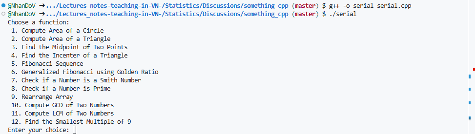

### 1. For the serial

- Select file (`serial.cpp`) then press `Run (F5)` or you can try as following
```bash
g++ -o serial serial.cpp
```
and
```bash
./serial
```


### 2. For the guess_game
```bash
g++ generate_string.cpp -o generate_string
```


### 3. Guess a number
```bash
g++ generate_string.cpp -o generate_string
```

