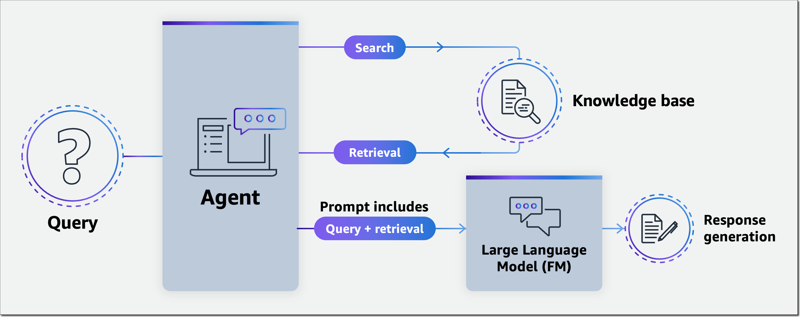
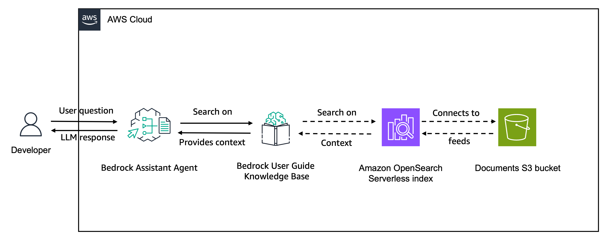

# Creating Agent with a Single Knowledge Base

In this folder, we provide an example of creating an agent with Amazon Bedrock and 
integrating it with [Knowledge Bases for Amazon Bedrock](https://aws.amazon.com/bedrock/knowledge-bases/). 
With this integration, the agent will be able to respond to a user query by taking a sequence of actions, 
consulting the knowledge base to obtain more information, and finally responding to the user with an answer.

In this notebook you will learn how to create an Amazon Bedrock Agent that makes use of Knowledge Bases to retrieve information relevant to a certain use case. 
We will create a Bedrock Assistant Agent that allows users to ask questions about the Bedrock User Guide based on the documents uploaded to the Knowledge Base.

The architecture created looks as following:

The code presented in this lab provides the following functionality:

1. Import the needed libraries
2. Upload the dataset to Amazon S3
3. Create the Knowledge Base for Amazon Bedrock using the [Boto3 Agents for Bedrock SDK](https://boto3.amazonaws.com/v1/documentation/api/latest/reference/services/bedrock-agent.html)
4. Create the Agent for Amazon Bedrock using the Boto3 Agents for Bedrock SDK
5. Test the Agent using the [Boto3 Agents for Bedrock Runtime SDK](https://boto3.amazonaws.com/v1/documentation/api/latest/reference/services/bedrock-agent-runtime.html)
6. Clean-up the resources created