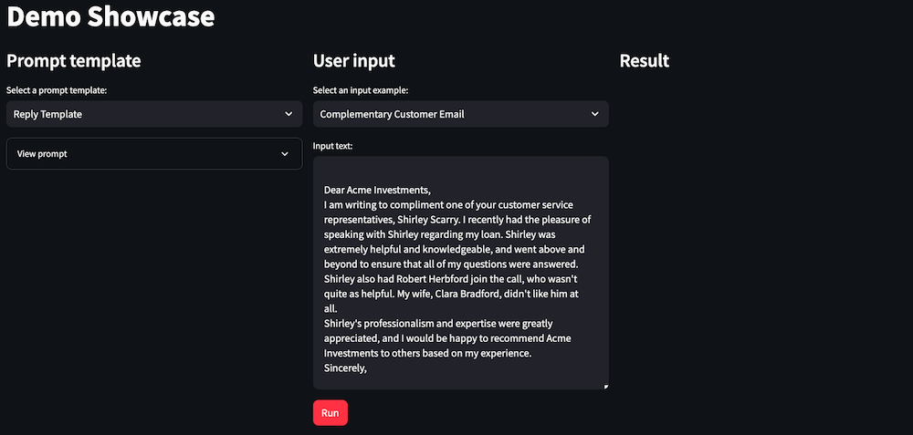

Final product:

In this lab, we will build a prompt showcase app with Amazon Bedrock and Streamlit. We will allow the user to select from a list of pre-made prompts and input content, pass them to Amazon Bedrock, and return Titan’s response. This application gives the end user direct control of the prompt template and input content.

You can build the application code by copying the code snippets below and pasting into the indicated Python file.

## Use cases
Demonstrating multiple text-to-text use cases in a single application.

## Prepare the scripts
### showcase_lib.py
``` python
import boto3
def get_prompt(user_input, template):    
    prompt = template.format(user_input=user_input)    
    return prompt
def get_text_response(user_input, template):

    session = boto3.Session()
    bedrock = session.client(service_name='bedrock-runtime')

    prompt = get_prompt(user_input, template)
    
    message = {
        "role": "user",
        "content": [ { "text": prompt } ]
    }
    
    response = bedrock.converse(
        modelId="anthropic.claude-3-sonnet-20240229-v1:0",
        messages=[message],
        inferenceConfig={
            "maxTokens": 2000,
            "temperature": 0,
            "topP": 0.9,
            "stopSequences": []
        },
    )
    
    return response['output']['message']['content'][0]['text']
```
### showcase_examples.py
``` python
#################################################################################################################################

prompts = {} #pre-defined prompt templatess, include "{user_input}" to merge input content
inputs = {} #used to merge into prompt templates, merged into the "{user_input}" placeholder
defaults = {} #used for default values in simple examples
#################################################################################################################################
# PROMPTS
#################################################################################################################################

prompts["Reply Template"] = """
{user_input}

Please write a reply to the above text:
"""

#################################################################################################################################

prompts["Summarize"] = """
{user_input}

Please summarize the above content:
"""

#################################################################################################################################

prompts["Sentiment"] = """
{user_input}

Sentiment of the above content (Positive or negative):
"""

#################################################################################################################################

prompts["Recommendation"] = """
{user_input}

Recommended next step based on the above content:
"""
#################################################################################################################################
# INPUTS
#################################################################################################################################

inputs["Complementary Customer Email"] = """
Dear Acme Investments,
I am writing to compliment one of your customer service representatives, Shirley Scarry. I recently had the pleasure of speaking with Shirley regarding my loan. Shirley was extremely helpful and knowledgeable, and went above and beyond to ensure that all of my questions were answered. Shirley also had Robert Herbford join the call, who wasn't quite as helpful. My wife, Clara Bradford, didn't like him at all.
Shirley's professionalism and expertise were greatly appreciated, and I would be happy to recommend Acme Investments to others based on my experience.
Sincerely,

Carson Bradford
"""

#################################################################################################################################

inputs["Ethics Complaint Email"] = """
Dear Acme Investments,
I am writing to bring to your attention a situation that I believe to be unethical on the part of one of your account managers, Roger Longbottom.
I recently met with Roger to discuss my investment portfolio and was deeply concerned to hear that he suggested I invest in a certain stock. When I asked him why he thought this was a good investment, he stated that the stock was currently undervalued and was likely to increase in value in the near future.
However, upon further research, I have discovered that the stock in question has a questionable reputation. It has been the subject of multiple lawsuits and has been found to have engaged in questionable business practices.
I believe Roger was aware of these facts, but failed to disclose them to me. As a result, I feel I was misled into making an unwise investment decision.
I therefore urge you to investigate whether Roger has acted unethically and take appropriate action if necessary.
Yours sincerely,
Carson Bradford
"""
```
### showcase_app.py
``` python
import streamlit as st
import showcase_lib as glib
import showcase_examples as examples

st.set_page_config(page_title="Demo Showcase", layout="wide")
st.title("Demo Showcase")
col1, col2, col3 = st.columns(3)

with col1:
    st.subheader("Prompt template")    
    prompts_keys = list(examples.prompts)
    prompt_selection = st.selectbox("Select a prompt template:", prompts_keys)
    
    with st.expander("View prompt"):
        selected_prompt_template_text = examples.prompts[prompt_selection]
        prompt_text = st.text_area("Prompt template text:", value=selected_prompt_template_text, height=350)

with col2:
    st.subheader("User input")
    inputs_keys = list(examples.inputs)    
    input_selection = st.selectbox("Select an input example:", inputs_keys)    
    selected_input_template_text = examples.inputs[input_selection]
    input_text = st.text_area("Input text:", value=selected_input_template_text, height=350)    
    process_button = st.button("Run", type="primary")

with col3:
    st.subheader("Result")    
    if process_button:
        with st.spinner("Running..."):
            response_content = glib.get_text_response(user_input=input_text, template=prompt_text)
            st.write(response_content)
```

## Launch the app

``` bash
cd ~/environment/workshop/labs/showcase
```

``` python
streamlit run showcase_app.py --server.port 8080
```



