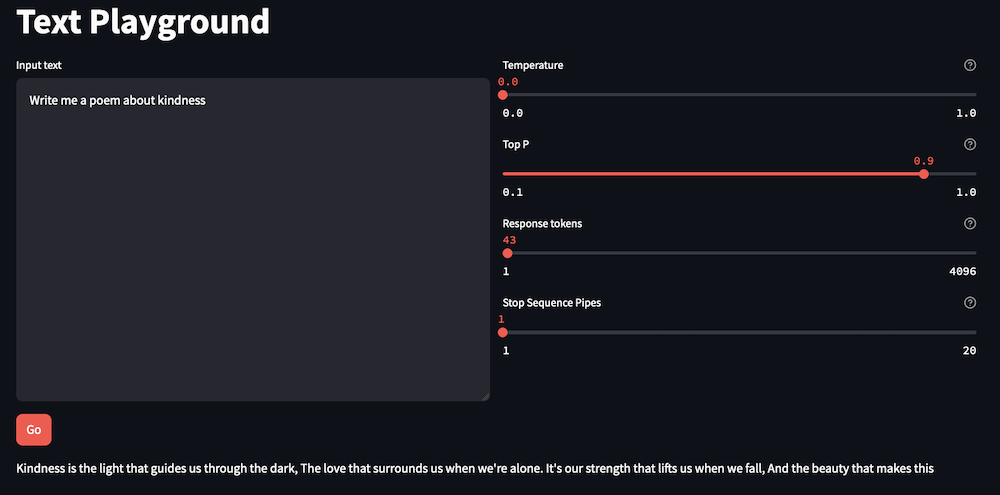
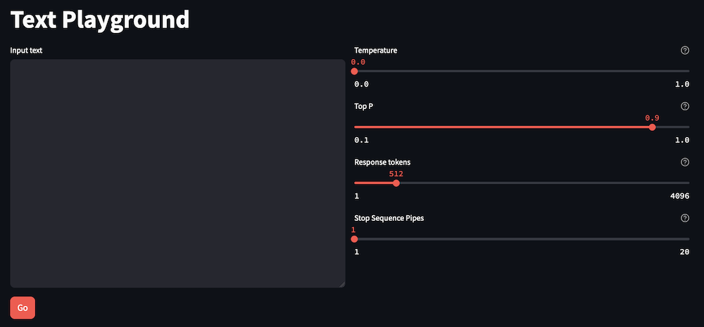

Final product:


In this lab, we will build a text playground with Amazon Titan Text and Streamlit. We will collect user input and inference parameters, pass it to Amazon Bedrock, and return Titan’s response. This application gives the end user direct control of the inference parameters.

You can build the application code by copying the code snippets below and pasting into the indicated Python file.

## Use cases
Developers cannot access the AWS console, but want to experiment with different prompts and inference parameters.

## Prepare the scripts
### text_playground_lib.py
``` python
import boto3
def get_text_response(model, input_content, temperature, top_p, max_token_count):

    session = boto3.Session()
    bedrock = session.client(service_name='bedrock-runtime')
    
    message = {
        "role": "user",
        "content": [ { "text": input_content } ]
    }
    
    response = bedrock.converse(
        modelId=model,
        messages=[message],
        inferenceConfig={
            "maxTokens": max_token_count,
            "temperature": temperature,
            "topP": top_p,
        },
    )
    
    return response['output']['message']['content'][0]['text']
```

### text_playground_app.py
``` python
import streamlit as st #all streamlit commands will be available through the "st" alias
import text_playground_lib as glib #reference to local lib script

st.set_page_config(layout="wide", page_title="Text Playground") #set the page width wider to accommodate columns
st.title("Text Playground") #page title
col1, col2 = st.columns(2) #create 2 columns

with col1:
    input_text = st.text_area("Input text", height=400) #display a multiline text box
    go_button = st.button("Go", type="primary") #display a primary button
            
with col2:
    model = "amazon.titan-text-express-v1"
    
    help_temperature = "Modulates the probability density function for the next tokens, implementing the temperature sampling technique. This parameter can be used to deepen or flatten the density function curve. A lower value results in a steeper curve and more deterministic responses, whereas a higher value results in a flatter curve and more random responses. (float, defaults to 0, max value is 1.5)"
    help_top_p = "Top P controls token choices, based on the probability of the potential choices. If you set Top P below 1.0, the model considers only the most probable options and ignores less probable options. The result is more stable and repetitive completions."
    help_response_tokens = "Configures the max number of tokens to use in the generated response. (int, defaults to 512)"
    help_stop_sequences = "Number of pipe symbols to use for a stop sequence."
    
    titan_temperature = st.slider("Temperature", min_value=0.0, max_value=1.0, value=0.0, step=0.1, help=help_temperature, format='%.1f')
    titan_top_p = st.slider("Top P", min_value=0.1, max_value=1.0, value=0.9, step=0.1, help=help_top_p, format='%.1f')
    titan_max_token_count = st.slider("Response tokens", min_value=1, max_value=4096, value=512, step=1, help=help_response_tokens)

if go_button: #code in this if block will be run when the button is clicked

    with st.spinner("Working..."): #show a spinner while the code in this with block runs
        response_content = glib.get_text_response( #call the model through the supporting library
            model=model,
            input_content=input_text, 
            temperature=titan_temperature, 
            top_p=titan_top_p, 
            max_token_count=titan_max_token_count) 

        st.write(response_content) #display the response content
```

## Launch the app



