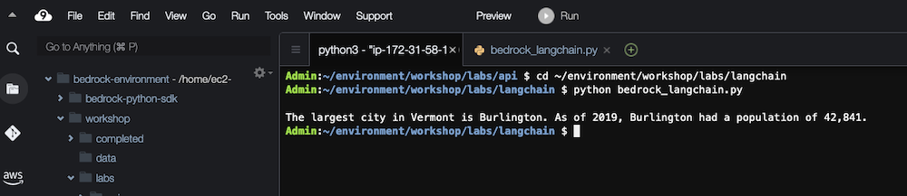
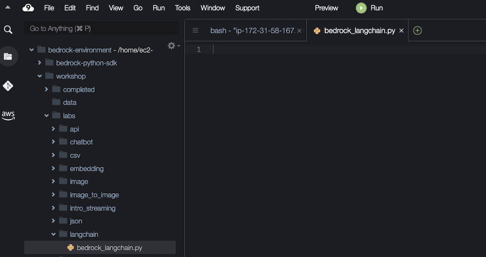

Final product:



In this lab, we will show how to make a basic call to Amazon Bedrock using LangChain. While similar in functionality to the previous lab where we called Bedrock through Boto3, in this lab we will use LangChain so you can compare the two approaches. LangChain can abstract away many of the details of using the Boto3 client, especially when you want to focus on text in and text out. If you need the full control enabled by the Boto3 client, it will always be an option for you. Boto3 may require more code, but it will give you full access to the JSON request and response objects.

You can build the application code by copying the code snippets below and pasting into the indicated Python file.

## Create the Python script 
Navigate to the workshop/labs/langchain folder, and open the file bedrock_langchain.py



```python
from langchain_community.llms import Bedrock
llm = Bedrock( #create a Bedrock llm client
    model_id="amazon.titan-text-express-v1" #set the foundation model
)
prompt = "What is the name of the largest city in Vermont? Just provide the name of the city:"
response_text = llm.invoke(prompt) #return a response to the prompt
print(response_text)
```
## Run the script
```bash
cd ~/environment/workshop/labs/langchain
```

```python
python bedrock_langchain.py
```

