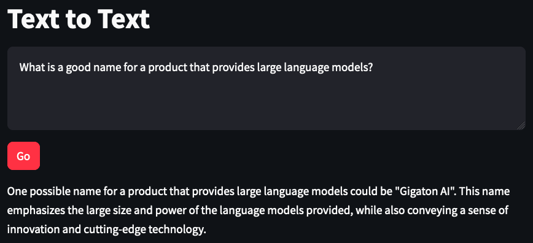
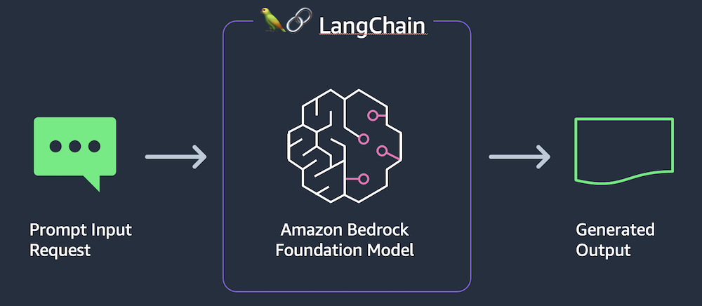
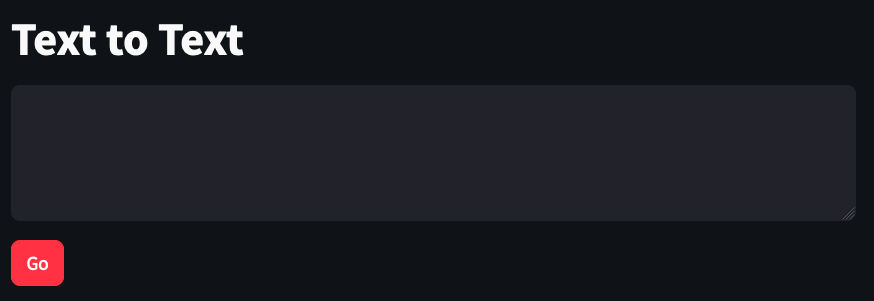

Final product:



In this lab, we will build a simple text generator with Amazon Bedrock , LangChain, and Streamlit. We will collect user input, pass it to Amazon Bedrock, and return the foundation model’s response. While this is a fairly trivial example, it allows us to understand how to build a basic generative AI prototype with very little code.

You can build the application code by copying the code snippets below and pasting into the indicated Python file.

## Use cases
The basic text generation pattern is good for the following use cases:

- General content creation, where factuality isn't critical
- Basic question & answer for well-known facts that are repeated frequently on the internet

## Architecture



This application consists of two files: one for the Streamlit front end, and one for the supporting library to make calls to Amazon Bedrock.

### python-lib
``` python
from langchain_community.llms import Bedrock
def get_text_response(input_content): #text-to-text client function

    llm = Bedrock( #create a Bedrock llm client
        model_id="cohere.command-text-v14", #set the foundation model
        model_kwargs={
            "max_tokens": 512,
            "temperature": 0,
            "p": 0.01,
            "k": 0,
            "stop_sequences": [],
            "return_likelihoods": "NONE"
        }
    )
    
    return llm.invoke(input_content) #return a response to the prompt

```

### streamlit front end (text.app)
``` python
import streamlit as st #all streamlit commands will be available through the "st" alias
import text_lib as glib #reference to local lib script

st.set_page_config(page_title="Text to Text") #HTML title
st.title("Text to Text") #page title
input_text = st.text_area("Input text", label_visibility="collapsed") #display a multiline text box with no label
go_button = st.button("Go", type="primary") #display a primary button

if go_button: #code in this if block will be run when the button is clicked
    
    with st.spinner("Working..."): #show a spinner while the code in this with block runs
        response_content = glib.get_text_response(input_content=input_text) #call the model through the supporting library
        
        st.write(response_content) #display the response content
```

## Run file
``` bash
cd ~/environment/workshop/labs/langchain_text
```

```python
streamlit run text_app.py --server.port 8080
```

In AWS Cloud9, select Preview -> Preview Running Application.


Try out some prompts and see the results.

            What is a good name for a product that provides large language models?
            Why is the sky blue?
            What is the capital of New Hampshire?
            I am pleased to meet you. What is the sentiment of the previous statement?
            
