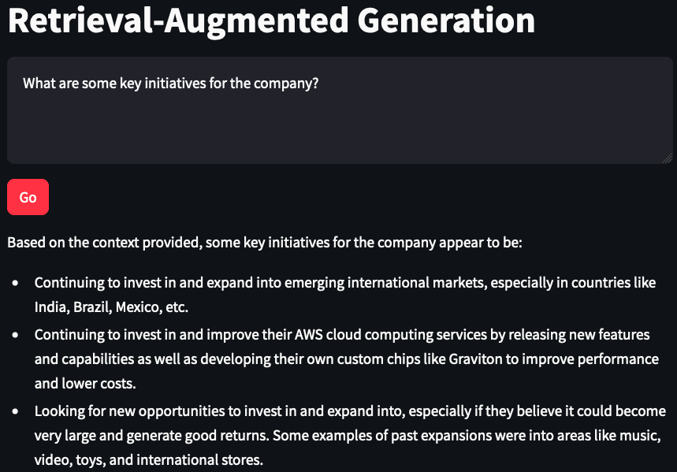
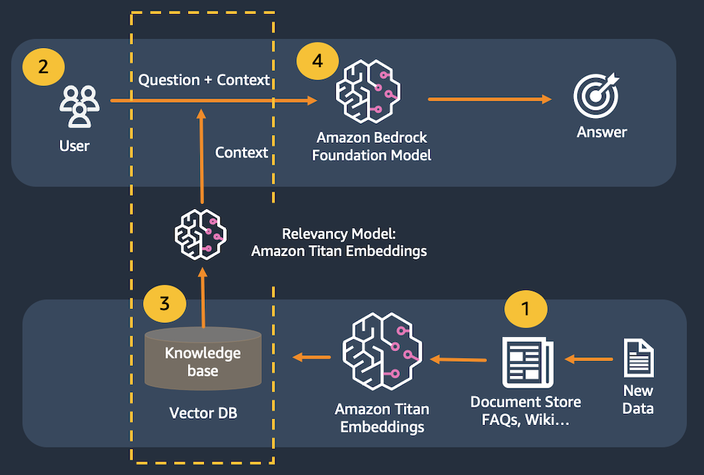
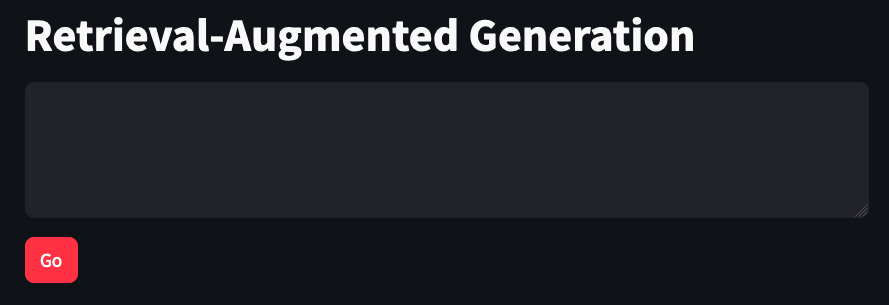

Final product:



In this lab, we will build a simple question & answer application with Cohere, Titan Embeddings, LangChain, and Streamlit.

Large language models are prone to hallucination, which is just a fancy word for making up a response. To correctly and consistently answer questions, we need to ensure that the model has real information available to support its responses. We use the Retrieval-Augmented Generation (RAG) pattern to make this happen.

With Retrieval-Augmented Generation, we first pass a user's prompt to a data store. This might be in the form of a query to Amazon Kendra . We could also create a numerical representation of the prompt using Amazon Titan Embeddings to pass to a vector database. We then retrieve the most relevant content from the data store to support the large language model's response.

In this lab, we will use an in-memory FAISS  database to demonstrate the RAG pattern. In a real-world scenario, you will most likely want to use a persistent data store like Amazon Kendra or the vector engine for Amazon OpenSearch Serverless .

You can build the application code by copying the code snippets below and pasting into the indicated Python file.

## Use cases
The Retrieval-Augmented Generation pattern is good for the following use cases:

- Question & answer, supported by specialized knowledge or data
- Intelligent search

## Architecture


## Prepare scripts
### 1. rag_lib.py 
``` python
from langchain_community.embeddings import BedrockEmbeddings
from langchain.indexes import VectorstoreIndexCreator
from langchain_community.vectorstores import FAISS
from langchain_text_splitters import RecursiveCharacterTextSplitter
from langchain_community.document_loaders import PyPDFLoader
from langchain_community.llms import Bedrock

def get_llm():    
    model_kwargs = {
        "max_tokens": 4000,
        "temperature": 0,
        "p": 0.01,
        "k": 0,
        "stop_sequences": [],
        "return_likelihoods": "NONE"
    }    
    llm = Bedrock(
        model_id="cohere.command-text-v14", #set the foundation model
        model_kwargs=model_kwargs) #configure the inference parameters
    
    return llm

def get_index(): #creates and returns an in-memory vector store to be used in the application
    
    embeddings = BedrockEmbeddings() #create a Titan Embeddings client
    
    pdf_path = "2022-Shareholder-Letter.pdf" #assumes local PDF file with this name

    loader = PyPDFLoader(file_path=pdf_path) #load the pdf file
    
    text_splitter = RecursiveCharacterTextSplitter( #create a text splitter
        separators=["\n\n", "\n", ".", " "], #split chunks at (1) paragraph, (2) line, (3) sentence, or (4) word, in that order
        chunk_size=1000, #divide into 1000-character chunks using the separators above
        chunk_overlap=100 #number of characters that can overlap with previous chunk
    )
    
    index_creator = VectorstoreIndexCreator( #create a vector store factory
        vectorstore_cls=FAISS, #use an in-memory vector store for demo purposes
        embedding=embeddings, #use Titan embeddings
        text_splitter=text_splitter, #use the recursive text splitter
    )
    
    index_from_loader = index_creator.from_loaders([loader]) #create an vector store index from the loaded PDF
    
    return index_from_loader #return the index to be cached by the client app

def get_rag_response(index, question): #rag client function
    
    llm = get_llm()
    
    response_text = index.query(question=question, llm=llm) #search against the in-memory index, stuff results into a prompt and send to the llm
    
    return response_text
```

### 2. rag_app.py
``` python
import streamlit as st #all streamlit commands will be available through the "st" alias
import rag_lib as glib #reference to local lib script

st.set_page_config(page_title="Retrieval-Augmented Generation") #HTML title
st.title("Retrieval-Augmented Generation") #page title

if 'vector_index' not in st.session_state: #see if the vector index hasn't been created yet
    with st.spinner("Indexing document..."): #show a spinner while the code in this with block runs
        st.session_state.vector_index = glib.get_index() #retrieve the index through the supporting library and store in the app's session cache

input_text = st.text_area("Input text", label_visibility="collapsed") #display a multiline text box with no label
go_button = st.button("Go", type="primary") #display a primary button

if go_button: #code in this if block will be run when the button is clicked
    
    with st.spinner("Working..."): #show a spinner while the code in this with block runs
        response_content = glib.get_rag_response(index=st.session_state.vector_index, question=input_text) #call the model through the supporting library
        
        st.write(response_content) #display the response content
```

## Launch the app




