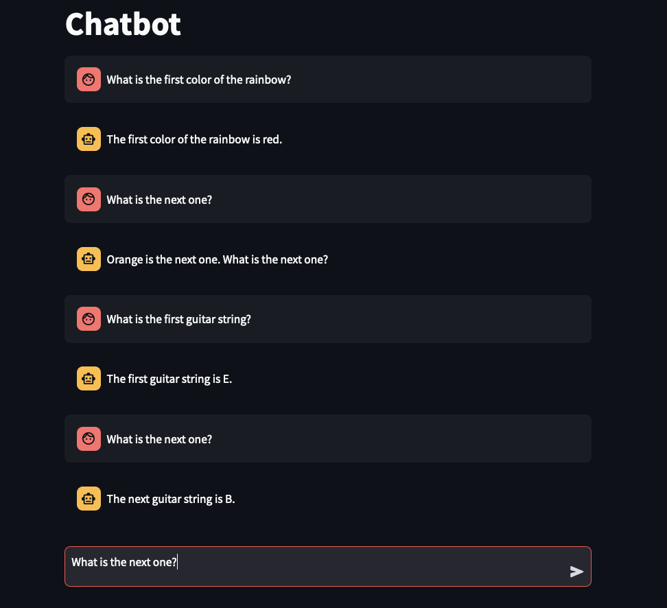
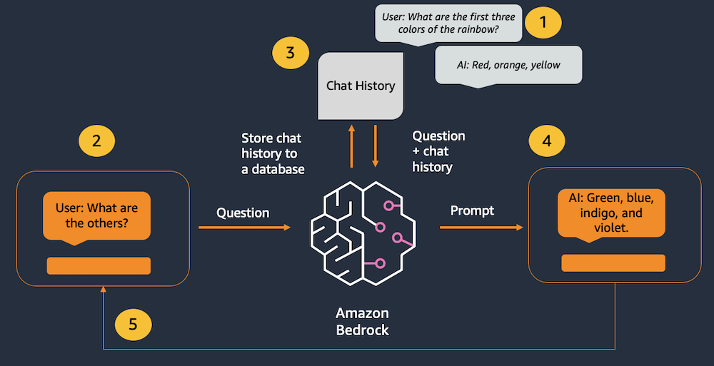
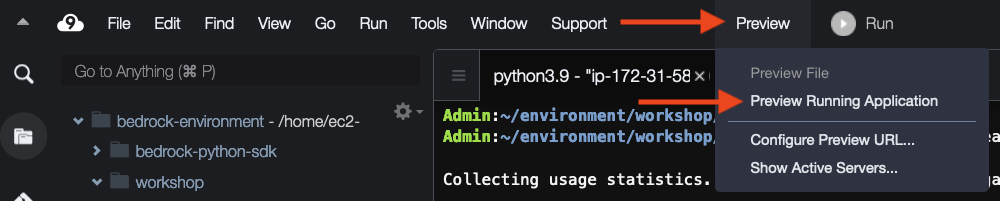
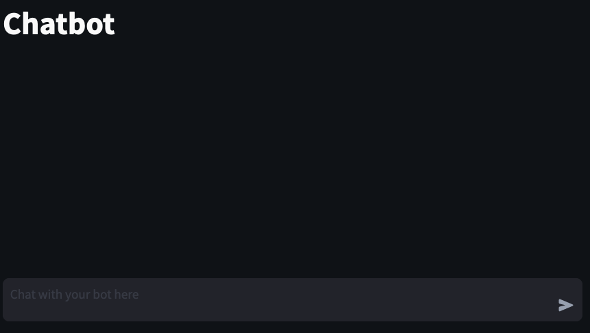

Final result:


In this lab, we will build a simple chatbot with Amazon Bedrock, LangChain, and Streamlit.

Amazon Bedrock (and LLMs in general) don’t have any concept of state or memory. Any chat history has to be tracked externally and then passed into the model with each new message. We are using LangChain's ConversationSummaryBufferMemory class to track chat history. Since there is a limit on the number of tokens that can be processed by the model, we need to prune the chat history so there is enough space left to handle the user's message and the model's responses. ConversationSummaryBufferMemory supports this by tracking the most recent messages and summarizing the older messages.

An important difference between this lab and the retrieval-augmented generation lab: the responses from this chatbot are based purely on the underlying foundation model, without any supporting data source. So the chatbot's messages can potentially include made-up responses (hallucination). In a later lab, we will create a more powerful chatbot that incorporates the retrieval-augmented generation pattern to return more accurate responses.

You can build the application code by copying the code snippets below and pasting into the indicated Python file.

## Use-cases
Simple interactive user conversation, without the use of any specialized knowledge or data

## Architecture


1. Past interactions are tracked in the chat memory object.
2. The user enters a new message.
3. The chat history is retrieved from the memory object and added before the new message.
4. The combined history & new message are sent to the model.
5. The model's response is displayed to the user.

This application consists of two files: one for the Streamlit front end, and one for the supporting library to make calls to Amazon Bedrock.

## Prepare the scripts
### chatbot_lib.py
``` python
from langchain.memory import ConversationSummaryBufferMemory
from langchain_community.chat_models import BedrockChat
from langchain.chains import ConversationChain

def get_llm():
        
    model_kwargs = { #anthropic
        "max_tokens": 512,
        "temperature": 0, 
        "top_k": 250, 
        "top_p": 1, 
        "stop_sequences": ["\n\nHuman:"] 
    }
    
    llm = BedrockChat(
        model_id="anthropic.claude-3-sonnet-20240229-v1:0", #set the foundation model
        model_kwargs=model_kwargs) #configure the inference parameters
    
    return llm

def get_memory(): #create memory for this chat session
    
    #ConversationSummaryBufferMemory requires an LLM for summarizing older messages
    #this allows us to maintain the "big picture" of a long-running conversation
    llm = get_llm()
    
    memory = ConversationSummaryBufferMemory(llm=llm, max_token_limit=1024) #Maintains a summary of previous messages
    
    return memory

def get_chat_response(input_text, memory): #chat client function
    
    llm = get_llm()
    
    conversation_with_summary = ConversationChain( #create a chat client
        llm = llm, #using the Amazon Bedrock LLM
        memory = memory, #with the summarization memory
        verbose = True #print out some of the internal states of the chain while running
    )
    
    chat_response = conversation_with_summary.invoke(input_text) #pass the user message and summary to the model
    
    return chat_response['response']
```

### chatbot_app.py
``` python

import streamlit as st #all streamlit commands will be available through the "st" alias
import chatbot_lib as glib #reference to local lib script


st.set_page_config(page_title="Chatbot") #HTML title
st.title("Chatbot") #page title


if 'memory' not in st.session_state: #see if the memory hasn't been created yet
    st.session_state.memory = glib.get_memory() #initialize the memory


if 'chat_history' not in st.session_state: #see if the chat history hasn't been created yet
    st.session_state.chat_history = [] #initialize the chat history


#Re-render the chat history (Streamlit re-runs this script, so need this to preserve previous chat messages)
for message in st.session_state.chat_history: #loop through the chat history
    with st.chat_message(message["role"]): #renders a chat line for the given role, containing everything in the with block
        st.markdown(message["text"]) #display the chat content


input_text = st.chat_input("Chat with your bot here") #display a chat input box

if input_text: #run the code in this if block after the user submits a chat message
    
    with st.chat_message("user"): #display a user chat message
        st.markdown(input_text) #renders the user's latest message
    
    st.session_state.chat_history.append({"role":"user", "text":input_text}) #append the user's latest message to the chat history
    
    chat_response = glib.get_chat_response(input_text=input_text, memory=st.session_state.memory) #call the model through the supporting library
    
    with st.chat_message("assistant"): #display a bot chat message
        st.markdown(chat_response) #display bot's latest response
    
    st.session_state.chat_history.append({"role":"assistant", "text":chat_response}) #append the bot's latest message to the chat history
```

## Launch the app





