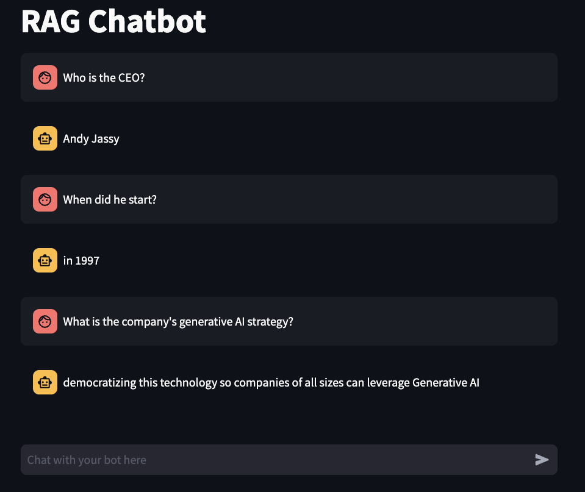
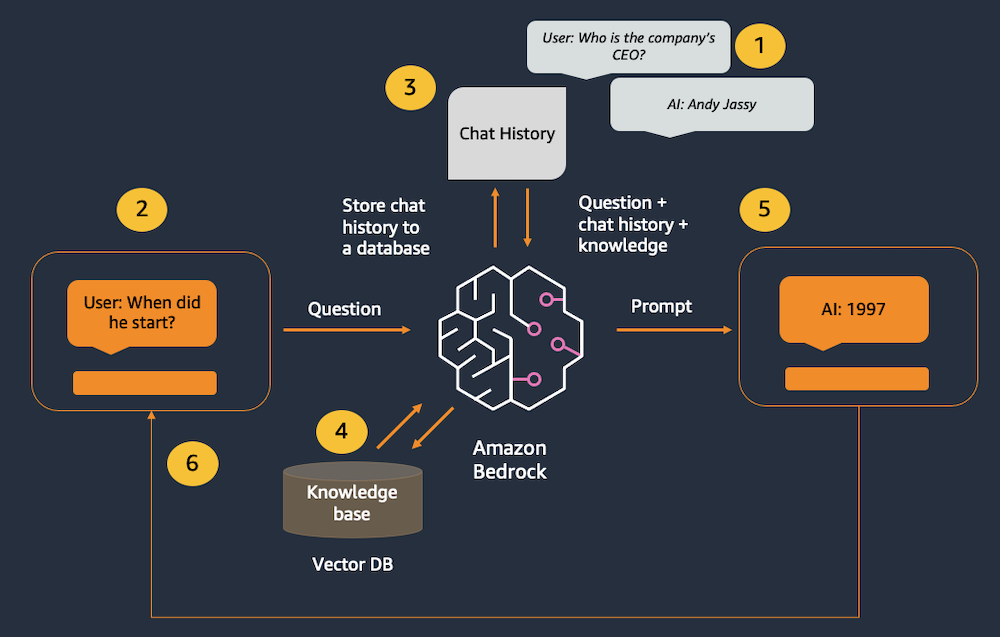
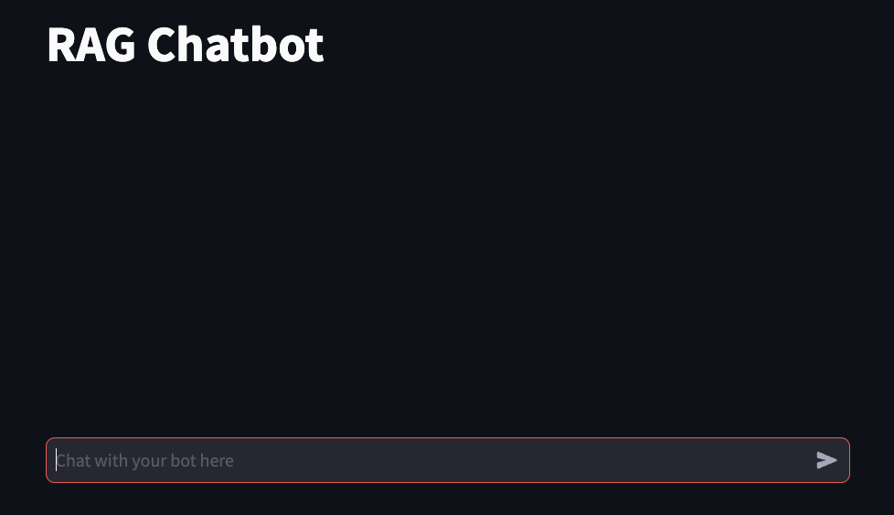

Final product:


Amazon Bedrock (and LLMs in general) don’t have any concept of state or memory. Any chat history has to be tracked externally and then passed into the model with each new message. We are using LangChain's ConversationBufferWindowMemory class to track chat history. Since there is a limit on the number of tokens that can be processed by the model, we need to prune the chat history so there is enough space left to handle the user's message and the model's responses. ConversationBufferWindowMemory supports this by tracking the most recent messages.

We also want to supplement the model's underlying data with external knowledge through Retrieval-Augmented Generation (RAG). We'll use LangChain's ConversationalRetrievalChain class to combine chatbot and RAG functionality in a single call to LangChain.

In this lab, we will build a chatbot supported by Retrieval-Augmented Generation (RAG). We'll use Anthropic Claude, Amazon Titan Embeddings, LangChain, and Streamlit. We will use an in-memory FAISS  database to demonstrate the RAG pattern. In a real-world scenario, you will most likely want to use a persistent data store like Amazon Kendra or the vector engine for Amazon OpenSearch Serverless .

You can build the application code by copying the code snippets below and pasting into the indicated Python file.

## Use-case
Simple interactive user conversation, supported by specialized knowledge or data

## Architecture


1. Past interactions are tracked in the chat memory object.
2. The user enters a new message.
3. The chat history is retrieved from the memory object and added before the new message.
4. The question is converted to a vector using Amazon Titan Embeddings, then matched to the closest vectors in the vector database.
5. The combined history, knowledge, and new message are sent to the model.
6. The model's response is displayed to the user.

This application consists of two files: one for the Streamlit front end, and one for the supporting library to make calls to Amazon Bedrock.

## Prepare the scripts
### rag_chatbot_lib.py
``` python
from langchain.memory import ConversationBufferWindowMemory
from langchain_community.chat_models import BedrockChat
from langchain.chains import ConversationalRetrievalChain

from langchain_community.embeddings import BedrockEmbeddings
from langchain.indexes import VectorstoreIndexCreator
from langchain_community.vectorstores import FAISS
from langchain_text_splitters import RecursiveCharacterTextSplitter
from langchain_community.document_loaders import PyPDFLoader

def get_llm():
        
    model_kwargs = { #anthropic
        "max_tokens": 512,
        "temperature": 0, 
        "top_k": 250, 
        "top_p": 1, 
        "stop_sequences": ["\n\nHuman:"] 
    }
    
    llm = BedrockChat(
        model_id="anthropic.claude-3-sonnet-20240229-v1:0", #set the foundation model
        model_kwargs=model_kwargs) #configure the inference parameters
    
    return llm

def get_index(): #creates and returns an in-memory vector store to be used in the application
    
    embeddings = BedrockEmbeddings() #create a Titan Embeddings client
    
    pdf_path = "2022-Shareholder-Letter.pdf" #assumes local PDF file with this name

    loader = PyPDFLoader(file_path=pdf_path) #load the pdf file
    
    text_splitter = RecursiveCharacterTextSplitter( #create a text splitter
        separators=["\n\n", "\n", ".", " "], #split chunks at (1) paragraph, (2) line, (3) sentence, or (4) word, in that order
        chunk_size=1000, #divide into 1000-character chunks using the separators above
        chunk_overlap=100 #number of characters that can overlap with previous chunk
    )
    
    index_creator = VectorstoreIndexCreator( #create a vector store factory
        vectorstore_cls=FAISS, #use an in-memory vector store for demo purposes
        embedding=embeddings, #use Titan embeddings
        text_splitter=text_splitter, #use the recursive text splitter
    )
    
    index_from_loader = index_creator.from_loaders([loader]) #create an vector store index from the loaded PDF
    
    return index_from_loader #return the index to be cached by the client app

def get_memory(): #create memory for this chat session
    
    memory = ConversationBufferWindowMemory(memory_key="chat_history", return_messages=True) #Maintains a history of previous messages
    
    return memory

def get_rag_chat_response(input_text, memory, index): #chat client function
    
    llm = get_llm()
    
    conversation_with_retrieval = ConversationalRetrievalChain.from_llm(llm, index.vectorstore.as_retriever(), memory=memory, verbose=True)
    
    chat_response = conversation_with_retrieval.invoke({"question": input_text}) #pass the user message and summary to the model
    
    return chat_response['answer']
```

### rag_chatbot_app.py

``` python
import streamlit as st #all streamlit commands will be available through the "st" alias
import rag_chatbot_lib as glib #reference to local lib script

st.set_page_config(page_title="RAG Chatbot") #HTML title
st.title("RAG Chatbot") #page title

if 'memory' not in st.session_state: #see if the memory hasn't been created yet
    st.session_state.memory = glib.get_memory() #initialize the memory

if 'chat_history' not in st.session_state: #see if the chat history hasn't been created yet
    st.session_state.chat_history = [] #initialize the chat history

if 'vector_index' not in st.session_state: #see if the vector index hasn't been created yet
    with st.spinner("Indexing document..."): #show a spinner while the code in this with block runs
        st.session_state.vector_index = glib.get_index() #retrieve the index through the supporting library and store in the app's session cache

#Re-render the chat history (Streamlit re-runs this script, so need this to preserve previous chat messages)
for message in st.session_state.chat_history: #loop through the chat history
    with st.chat_message(message["role"]): #renders a chat line for the given role, containing everything in the with block
        st.markdown(message["text"]) #display the chat content

input_text = st.chat_input("Chat with your bot here") #display a chat input box

if input_text: #run the code in this if block after the user submits a chat message
    
    with st.chat_message("user"): #display a user chat message
        st.markdown(input_text) #renders the user's latest message
    
    st.session_state.chat_history.append({"role":"user", "text":input_text}) #append the user's latest message to the chat history
    
    chat_response = glib.get_rag_chat_response(input_text=input_text, memory=st.session_state.memory, index=st.session_state.vector_index,) #call the model through the supporting library
    
    with st.chat_message("assistant"): #display a bot chat message
        st.markdown(chat_response) #display bot's latest response
    
    st.session_state.chat_history.append({"role":"assistant", "text":chat_response}) #append the bot's latest message to the chat history
```

## Launch the app



