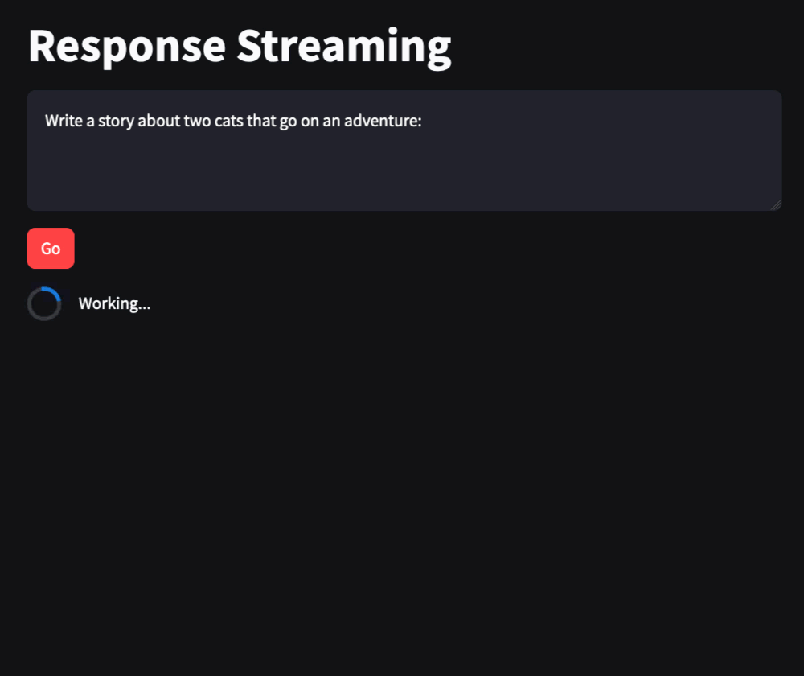
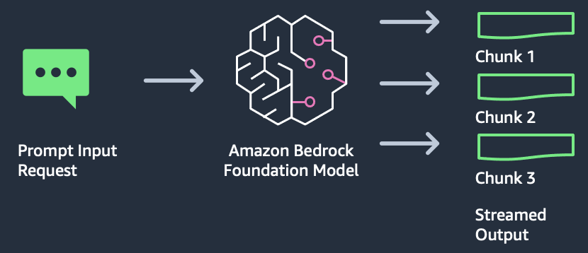
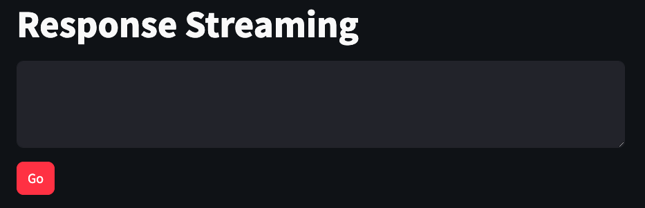

Final product:



In this lab, we will build a response streaming application using Amazon Bedrock, LangChain, and Streamlit.

Streaming responses are useful when you want to start returning content immediately to the end user. You can display the output a few words at a time, instead of waiting for the entire response to be created.

You can build the application code by copying the code snippets below and pasting into the indicated Python file.

## Use case
Situations where longer text will be generated, but you want to keep the user engaged by beginning to return a response immediately.

## Architecture


From an architectural perspective, response streaming is similar to text-to-text. We just need to add a special handler to immediately process the streaming output as it is created.

The streamed response is returned in chunks of JSON. You can then extract the returned text from each chunk to be displayed to the end user.

This application consists of two files: one for the Streamlit front end, and one for the supporting library to make calls to Amazon Bedrock.


## Prepare the scripts
### streaming_lib.py
``` python
from langchain.chains import ConversationChain
from langchain_community.llms import Bedrock

def get_llm(streaming_callback):
    model_kwargs = {
        "max_tokens": 4000,
        "temperature": 0,
        "p": 0.01,
        "k": 0,
        "stop_sequences": [],
        "return_likelihoods": "NONE",
        "stream": True
    }
    
    llm = Bedrock(
        model_id="cohere.command-text-v14",
        model_kwargs=model_kwargs,
        streaming=True,
        callbacks=[streaming_callback],
    )
    
    return llm

def get_streaming_response(prompt, streaming_callback):
    conversation_with_summary = ConversationChain(
        llm=get_llm(streaming_callback)
    )
    return conversation_with_summary.predict(input=prompt)
```

### streaming_app.py
``` python
import streaming_lib as glib  # reference to local lib script
import streamlit as st
from langchain_community.callbacks.streamlit import StreamlitCallbackHandler

st.set_page_config(page_title="Response Streaming")  # HTML title
st.title("Response Streaming")  # page title

input_text = st.text_area("Input text", label_visibility="collapsed")
go_button = st.button("Go", type="primary")  # display a primary button

input_text = st.text_area("Input text", label_visibility="collapsed")
go_button = st.button("Go", type="primary")  # display a primary button
```

## Launch the app


