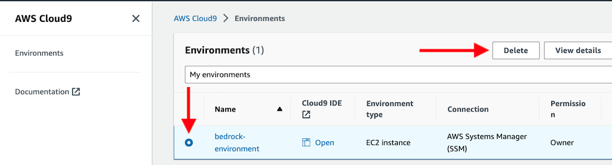
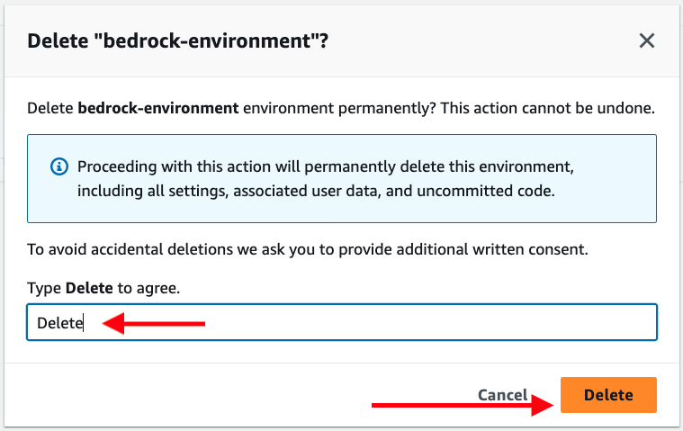
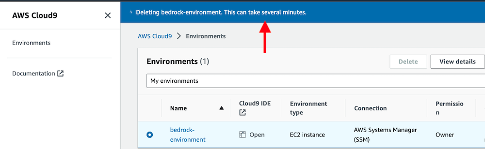
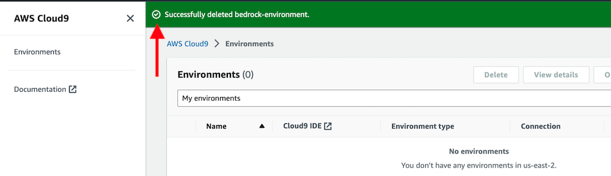

Follow the steps below to delete your AWS Cloud9 environment. This will help you avoid additional costs after the workshop is completed.

In the AWS Cloud9 console, select the radio button by the bedrock-environment item, the select the Delete button.

In the Delete confirmation dialog, type Delete into the confirmation text box, then select the Delete button.

Wait several minutes while the bedrock-environment environment is deleted.

You should see a banner confirming that the environment was deleted.
