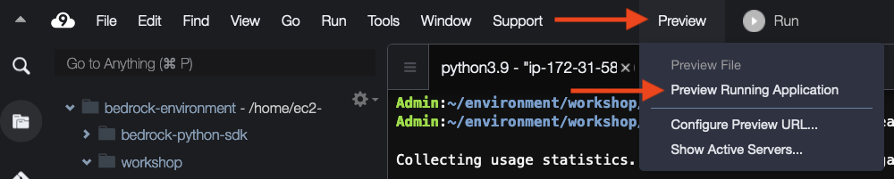

## Run the prompt app
Select the bash terminal in AWS Cloud9 and paste the following:
```
cd ~/environment/workshop/completed/prompt
streamlit run prompt_app.py --server.port 8080
```

Ignore the Network URL and External URL links displayed by the Streamlit command. Instead, we will use AWS Cloud9's preview feature.

In AWS Cloud9, select Preview -> Preview Running Application.



You should see a web page like below. You can drag the tab to a different position so that the content will be wider:


 
## Prompt tool overview


1. Use the Lab context radio buttons to determine which text will get inserted into prompts that have a “{context}” placeholder.
2. You can see the context that will be inserted under the See context expand panel.
3. prompts from the lab guide into the Prompt template text field.
4. Select the model you want to respond to the prompt. When a specific model is indicated in the lab guide, be sure to select that model here.
5. Press the Run button to send the prompt to the selected model.
6. The model’s response will show up under Result