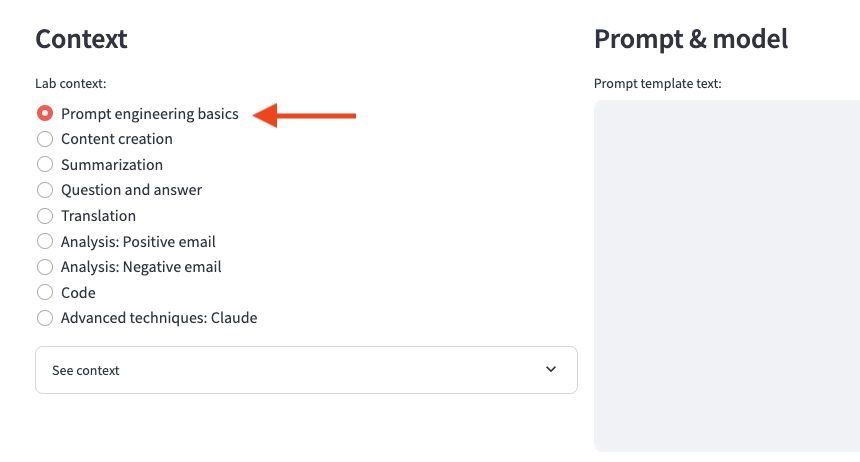

Lab introduction
In this lab, we will learn some basic prompt engineering techniques. The two most important considerations for working with large language models are to communicate clearly and provide context.

## 1. Communicate clearly
The art of prompt engineering is the art of communication. Large language models have been trained on a massive amount of written and transcribed human content. So just like communicating with people, it's critical to communicate clearly with the models. Ambiguous requests and missing details will lead to undesirable responses. Throughout these exercises, you will see examples of varying levels of detail and clarity.

## 2. Provide context
Depending on when and how a large language model was trained, it will often need additional information to help it respond to a prompt appropriately. Applications like chatbots and others may need to add this context to a prompt based on a user's question.

The exercises below should help illustrate the importance of providing context to large language models.

## Prompt application configuration

Be sure to select the Prompt engineering basics radio button under the Lab context section of the prompt application you set up earlier.

 
## Prompt exercises
You can use the copy buttons in the boxes below to automatically copy the prompt. Paste each prompt and submit one at a time into the prompt app.

## Fundamental patterns: Providing context
### Handling recent events
All foundation models were trained on data from the past. This training data could have been from a month ago or two years ago. If you want the model to be able to respond to requests about recent events, you will need to provide it with that information, usually in the form of retrieval-augmented generation. We'll cover this in depth in later labs.

### Prompts to try: responses with and without context
Paste each prompt and submit one at a time into the web application. Review the displayed responses.

            All models
            What was the high temperature yesterday?

The first prompt will likely result in either hallucination or the model declining to answer the question. The following prompt should generate a correct response based on the provided context:

            All models
            The low temperature yesterday was 30 degrees Fahrenheit, and the high was 48 degrees.
            What was the high temperature yesterday?
 
### Handling internal knowledge
An organization's internal knowledge would not have been available to the model at training time. Similar to handling recent events, we will also need to provide that internal information as context along with the user's request.

### Prompts to try: responses with and without internal knowledge
Paste each prompt and submit one at a time into the web application. Review the displayed responses.

            All models
            What do you know about Project Snerdgrass?

The first prompt will likely result in either hallucination or the model declining to answer the question. The following prompt should generate a "correct" answer based on the provided context:

            All models
            Project Snerdgrass is an in-home installation of vacuum tubes for trash disposal. It costs $200 per month and can be used for composting, recycling, and rubbish.
            What do you know about Project Snerdgrass?

### Handling chat history
Foundation models have no inherent memory. In order to maintain a conversation, we must "remind" the model about our conversation up until this point. This usually comes in the form of past messages, a summary of the conversation, or a combination of both. The chatbot application is responsible for maintaining this memory and passing it along to the model with each new message from the user.

### Prompts to try: responses with and without chat history

            All models
            What is the capital's population?

The first prompt will likely result in a made-up response. The following prompt's response should take into account that the question is related to Concord, New Hampshire:

            All models
            What is the capital of New Hampshire?
            The capital of New Hampshire is Concord.
            What is the capital's population?
 

In the following labs, you will see various prompt examples that may directly include their context, or may have that context pulled in via a {context} placeholder in the text.