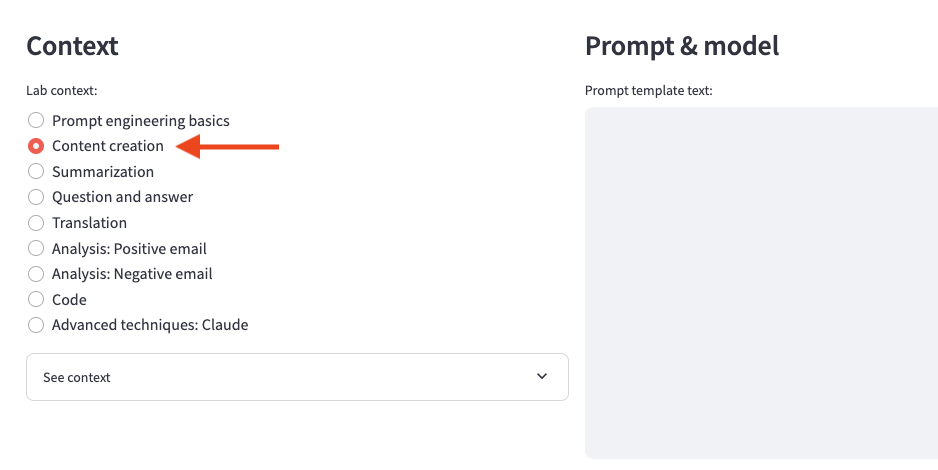

# Lab introduction
In this lab, we will learn how to write prompts to generate content. Use cases include:

- Brainstorming
- Outlining
- First draft
- Rewriting
 
## Prompt application configuration
Be sure to select the Content creation radio button under the Lab context section of the prompt application you set up earlier.

 

A note on {context} placeholders
Some of the prompt exercises below will include a {context} placeholder. This allows us to reuse content and keep the examples below from getting too large. The See context expander in the prompt application will show you the text that will be inserted into the {context} placeholders when those examples are run. 

### Prompt exercises
You can use the copy buttons in the boxes below to automatically copy the prompt. Paste each prompt and submit one at a time into the prompt app.

### Brainstorming
Blocked on where to start? Have the model generate a list of ideas for you!

            All models
            Please create a list of startup ideas for a new generative AI service for the food industry:

### Brainstorming with more details
You can also influence the format of responses by letting the model know what you want to see:

            All models
            Please create a list of startup ideas for a new generative AI service for the food industry. For each startup idea, provide a name and a one-sentence elevator pitch for what the startup will do.

            Challenge
            Can you alter the prompt to be more specific, or add more details?

            Hint
            Could you have it focus on restaurants, food manufacturers, or consumers?

            Can you have it indicate the target market for each startup idea?