*Final product:*

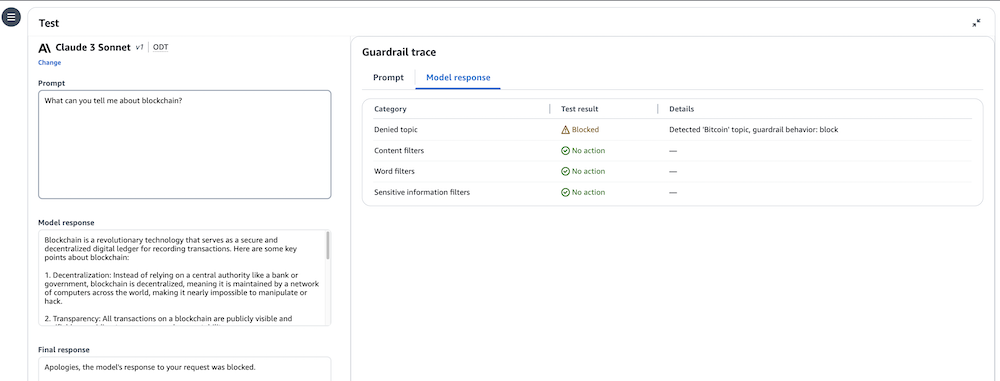

## Lab introduction
In this lab, we will walk through the manual creation and testing of a guardrail using the AWS Console.

In addition to manual creation, there are multiple ways to automate the creation of guardrails, including SDKs, infrastructure-as-code, and CLI commands.

AWS API documentation: https://docs.aws.amazon.com/bedrock/latest/APIReference/API_CreateGuardrail.html 
AWS CLI documentation: https://docs.aws.amazon.com/cli/latest/reference/bedrock/create-guardrail.html 
AWS CloudFormation documentation: https://docs.aws.amazon.com/AWSCloudFormation/latest/UserGuide/aws-resource-bedrock-guardrail.html 
Terraform documentation (awscc): https://registry.terraform.io/providers/hashicorp/awscc/latest/docs/resources/bedrock_guardrail 
In the following lab, we will learn how to create guardrails programmatically using the Python Boto3 API 

## Guardrail creation walkthrough
We'll start by creating a guardrail with sample configurations for each major component of a guardrail. You will want to design your guardrails based on your specific application's requirements.

From the Amazon Bedrock navigation menu, under Safeguards, select Guardrails

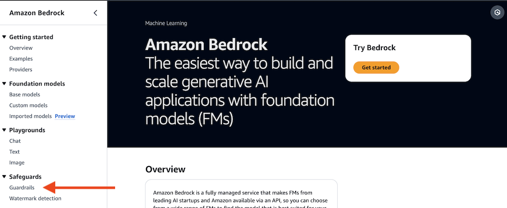

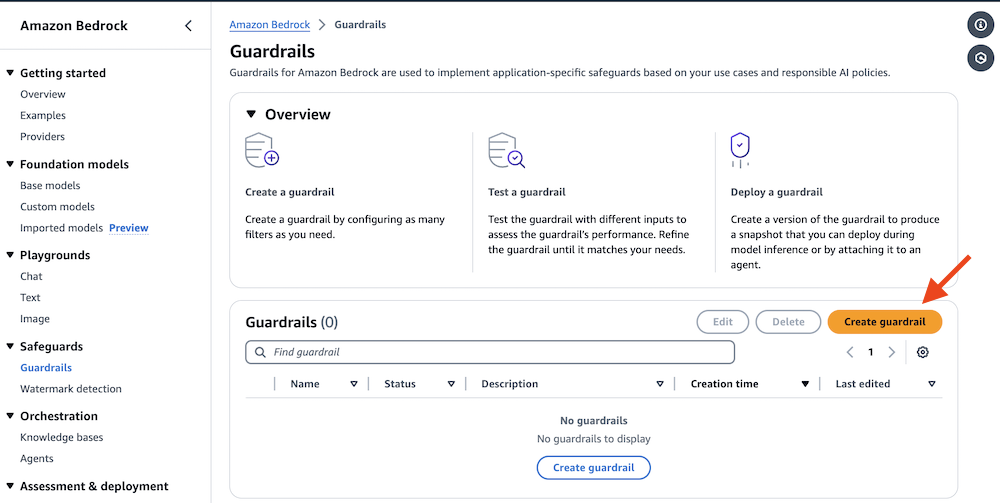

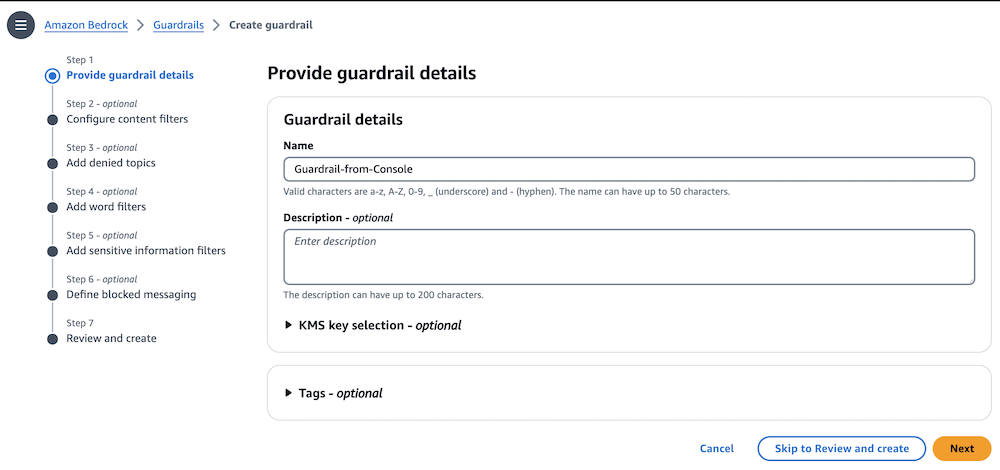

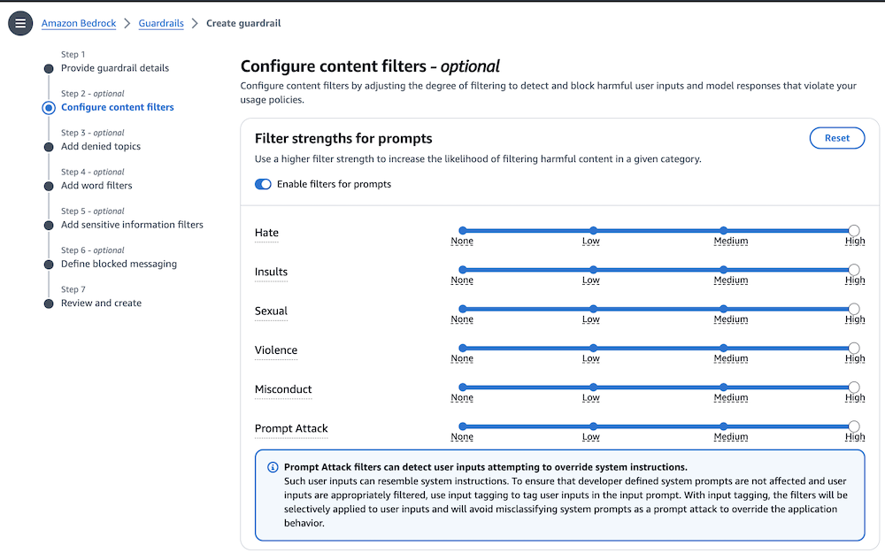

Under Filter strengths for responses, turn on the Enable filters for responses toggle

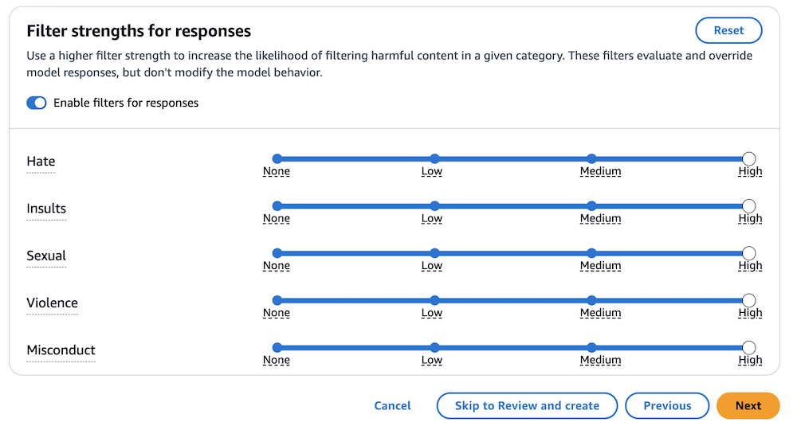

## Add denied topics
The next step sets any denied topics that should be blocked. In our example, we specify a topic to be detected in user inputs and model responses. You can add up to 30 denied topics. If a user’s input or the model response matches the denied topic, a rejection message will be returned to the user. Optionally, you can also add sample phrases to help the guardrail understand what to look for.

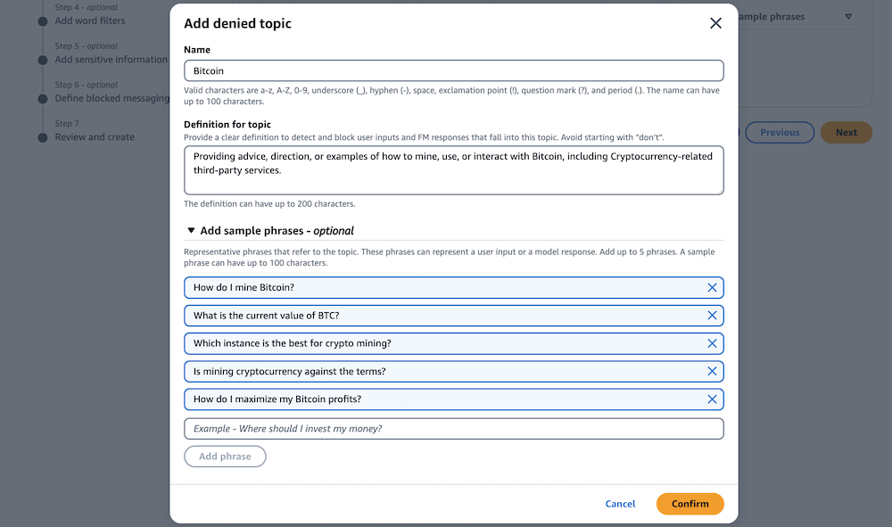

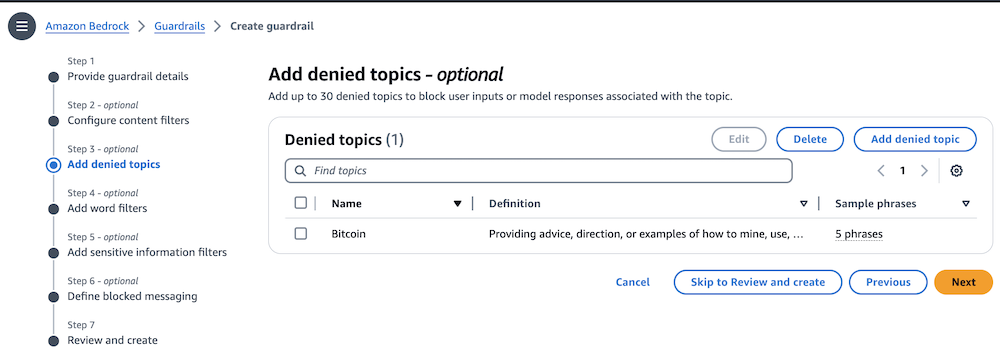

## Add word filters

In this step, we add specific word filters that will be blocked in both user inputs and model responses. Amazon Bedrock Guardrails also offers a pre-defined profanity list that can be enabled. We will enable a globally-defined profanity filter, and add a word filter for our fictional competitor "AnyCompany".

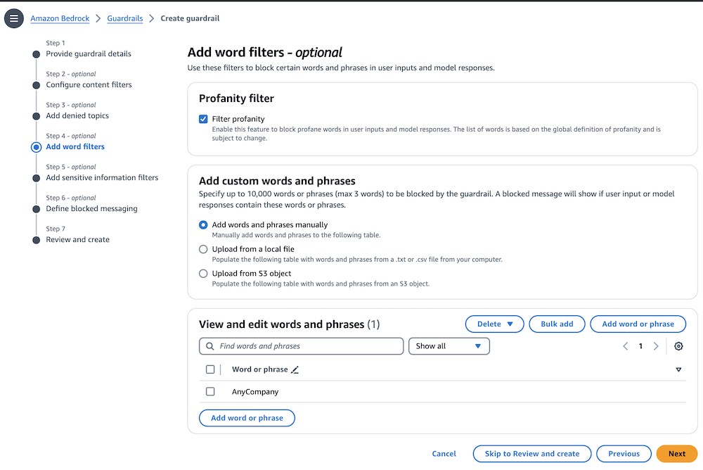

## Add sensitive information filters

Guardrails also allows the capability to redact or mask sensitive information such as Personally Identifiable Information. You can also use Regular Expressions (RegEx) to pattern match on types on information, such as account numbers.

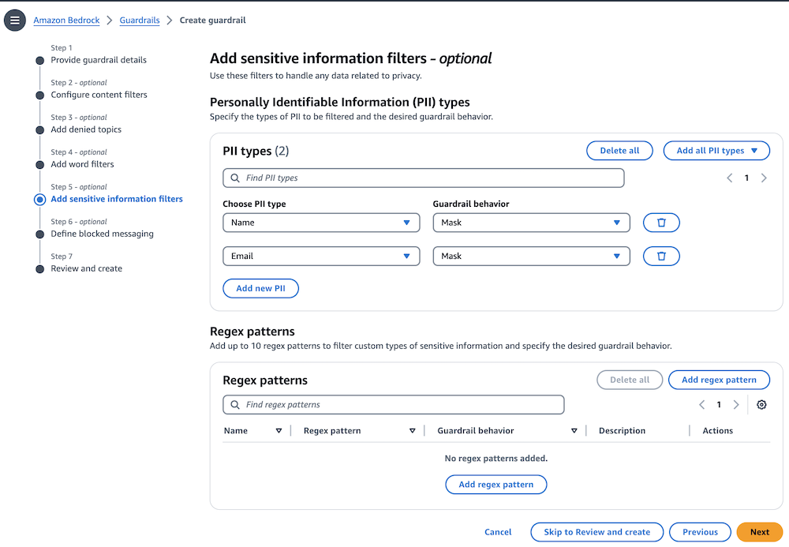

## Define blocked messaging
Finally, specific individual messages for blocked user inputs and model responses are added.

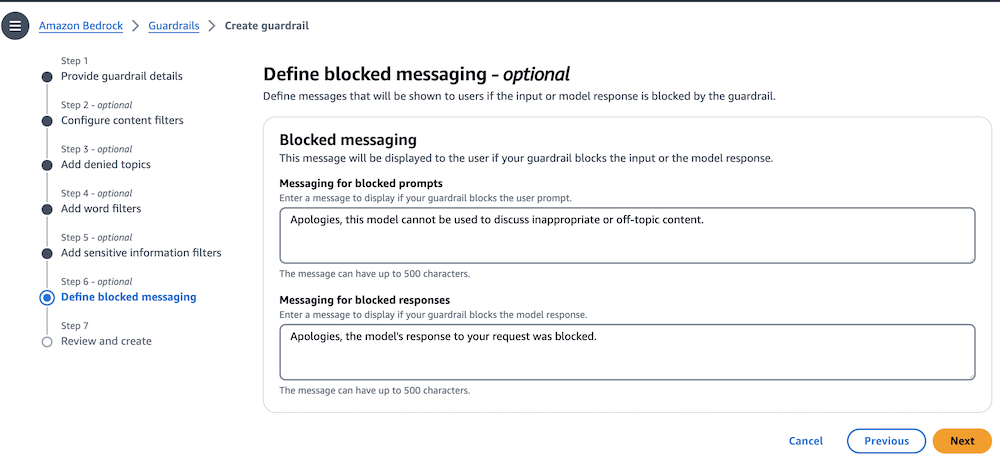

## Review and create guardrail
In the final step of the creation process, you can review the guardrail details prior to creating it.

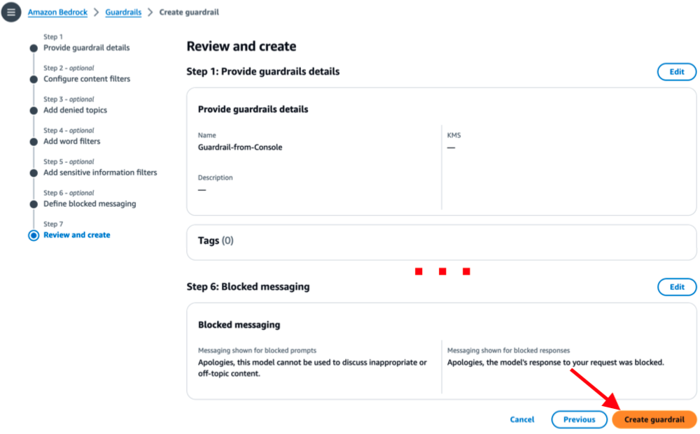

## Test the draft guardrail

Once your guardrail has been defined, you can test the guardrail with an Amazon Bedrock model. The AWS Console includes a testing feature where you can enter test prompts and evaluate guardrail actions.

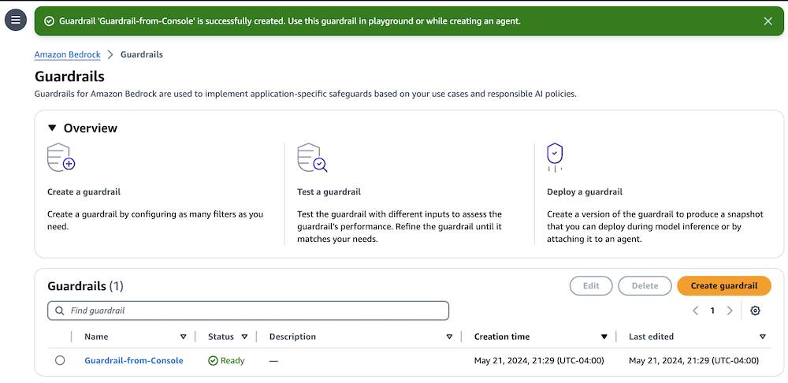

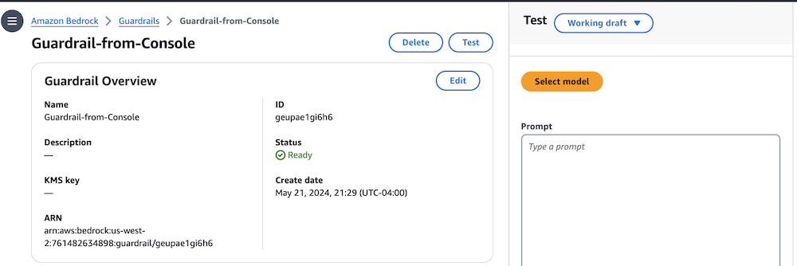

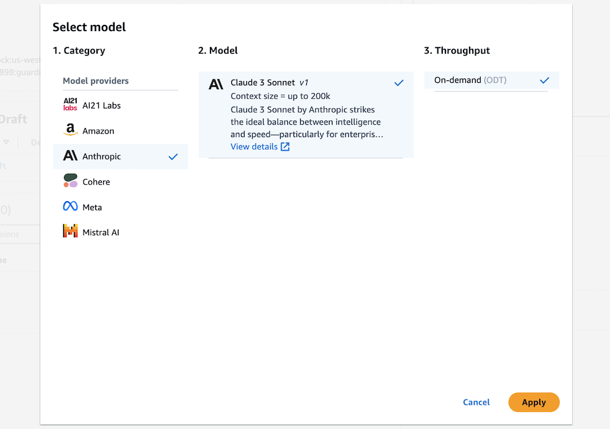

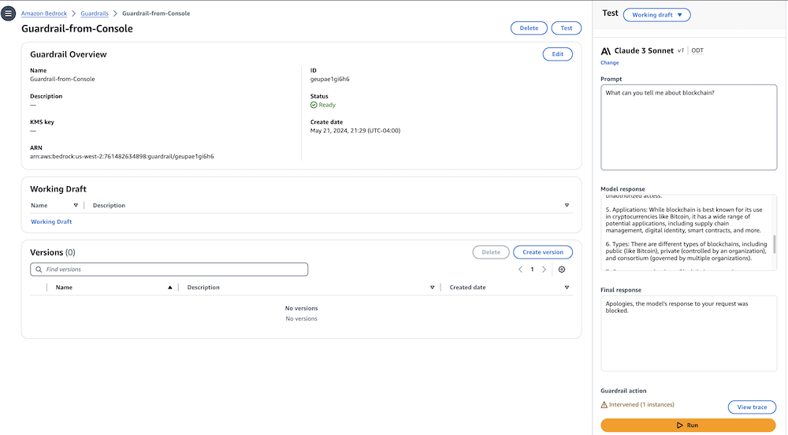

This is an example of our scenario where we want to prevent our users from asking advice related to Crypto or Bitcoin. When there is a blocked model response, you can see the model's unfiltered response in the Model response field, and the actual redacted/blocked response in the Final response field.

## View the guardrail trace
For each interaction, you can see which of your entered categories that the prompt triggered and what the results of the test were.

## Create the guardrail version
Finally, once your guardrail is aligned with your desired use case, you can create a specific version of the guardrail. When invoking the guardrail, you specify the guardrail ID and the guardrail version you wish to use. This allows you to iterate on additional functionality without impacting any applications currently in use.

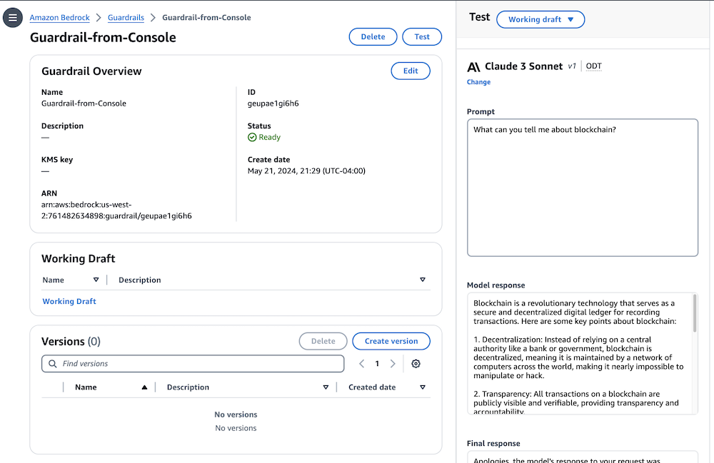

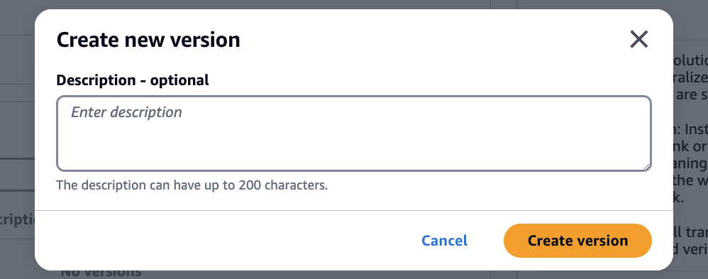

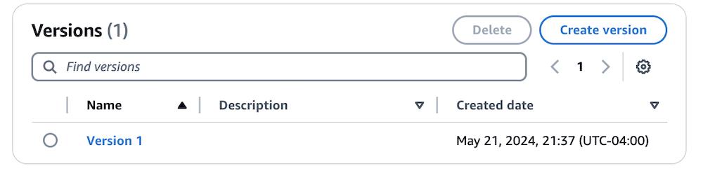