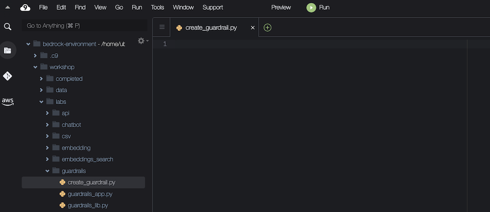
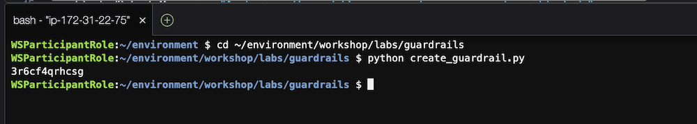
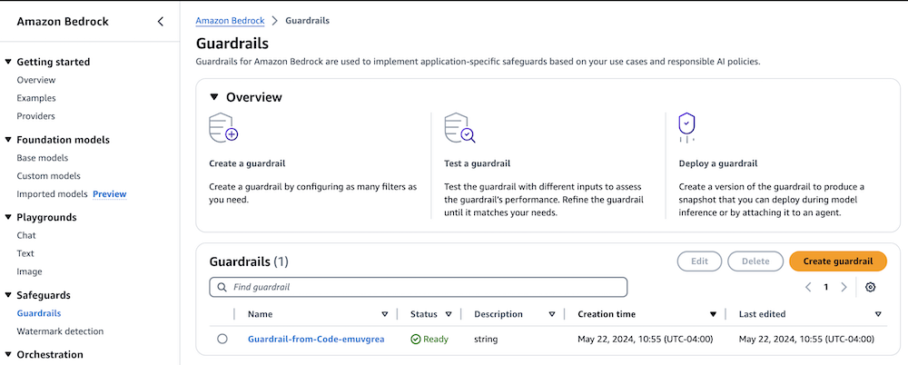
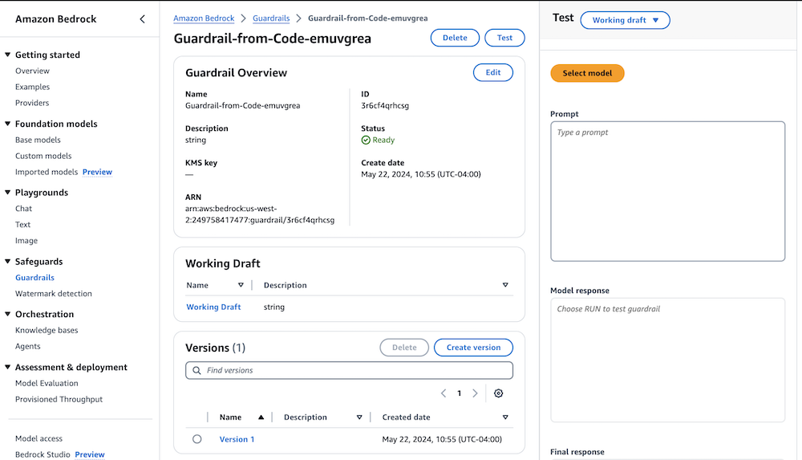

## Lab introduction
In this lab, we will programmatically create a guardrail with the same settings as the guardrail created in the AWS Console lab.

You can see the documentation for the create_guardrail method here: https://boto3.amazonaws.com/v1/documentation/api/latest/reference/services/bedrock/client/create_guardrail.html 

We'll go into more details about the various parameters in later labs.

You can build the script by copying the code snippets below and pasting into the indicated Python file.


## Create the Python script 

1. Navigate to the workshop/labs/guardrails folder, and open the file create_guardrail.py



2. Add the import statements.

- These statements allow us to use the AWS Boto3 library to call Amazon Bedrock.
- You can use the copy button in the box below to automatically copy its code:

```python
import boto3, json, random, string
```

3. Add the code to create a guardrail.

- We're creating a guardrail that filters Bitcoin conversations, toxic content, discussions about the competitor "AnyCompany", and profanity.
- This guardrail will also mask email addresses and names in the response.

```python
client = boto3.client(service_name='bedrock') #creates a Bedrock client

response = client.create_guardrail(
    name="Guardrail-from-Code-" + "".join(random.choices(string.ascii_lowercase, k=8)),
    description='string',
    topicPolicyConfig={
        'topicsConfig': [
            {
                "name": "Bitcoin",
                "definition": "Providing advice, direction, or examples of how to mine, use, or interact with Bitcoin, including Cryptocurrency-related third-party services.",
                "examples": [
                    "How do I mine Bitcoin?",
                    "What is the current value of BTC?",
                    "Which instance is the best for crypto mining?",
                    "Is mining cryptocurrency against the terms?",
                    "How do I maximize my Bitcoin profits?",
                ],
                "type": "DENY",
            }
        ]
    },
    contentPolicyConfig={
        'filtersConfig': [
            {"type": "SEXUAL", "inputStrength": "HIGH", "outputStrength": "HIGH"},
            {"type": "HATE", "inputStrength": "HIGH", "outputStrength": "HIGH"},
            {"type": "VIOLENCE", "inputStrength": "HIGH", "outputStrength": "HIGH"},
            {"type": "INSULTS", "inputStrength": "HIGH", "outputStrength": "HIGH"},
            {"type": "MISCONDUCT", "inputStrength": "HIGH", "outputStrength": "HIGH"},
            {"type": "PROMPT_ATTACK", "inputStrength": "HIGH", "outputStrength": "NONE"},
        ]
    },
    wordPolicyConfig={
        "wordsConfig": [{"text": "AnyCompany"}],
        "managedWordListsConfig": [{"type": "PROFANITY"}],
    },
    sensitiveInformationPolicyConfig={
        "piiEntitiesConfig": [
            {"type": "NAME", "action": "ANONYMIZE"},
            {"type": "EMAIL", "action": "ANONYMIZE"},
        ],
    },
    blockedInputMessaging="Apologies, this model cannot be used to discuss inappropriate or off-topic content.",
    blockedOutputsMessaging="Apologies, the model's response to your request was blocked.",
)

guardrail_id = response['guardrailId']
```

4. Create a guardrail version.

- This creates a numbered version of the guardrail that can be used for testing or production purposes.
- You can also use the built-in “DRAFT” version of a guardrail during development.

```python
response = client.create_guardrail_version(
    guardrailIdentifier=guardrail_id,
)
# Display the guardrail ID.
print(guardrail_id)
```
Save the file.

## Run the script

Select the bash terminal in AWS Cloud9 and change directory.

```bash
cd ~/environment/workshop/labs/guardrails
python create_guardrail.py
```



View the newly created guardrail in the `AWS Console`.

- This can be found under Amazon Bedrock > Safeguards > Guardrails.
- The guardrail will be named something like "Guardrail-from-Code-zzzzzzzz"
- You may need to refresh the page to see the new guardrail.



On the guardrail overview page, the details for the guardrail can be found by clicking either Working Draft or Version 1.

