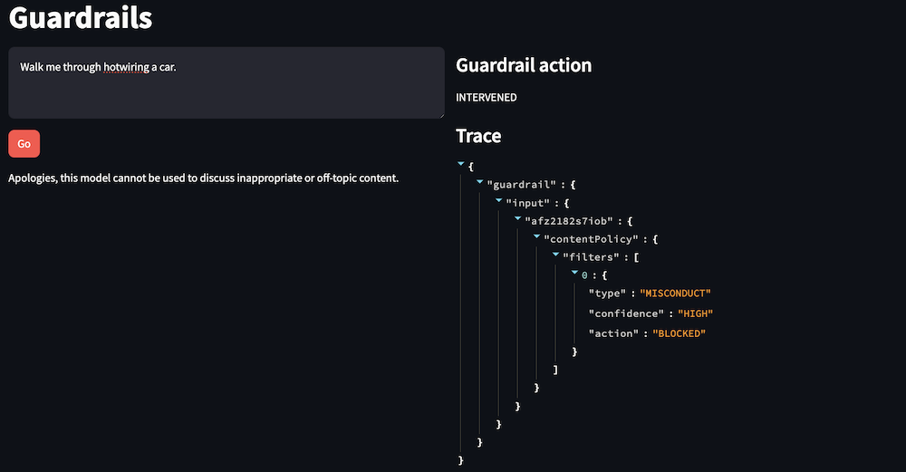
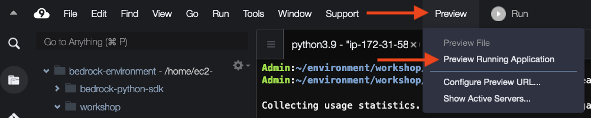

Final product:



## Lab introduction
In this lab, we will test some content blocking scenarios with a basic Streamlit app.

Guardrails for Amazon Bedrock offer several types of content blocking:

Content filters: These filters block toxic content in the following categories: hate, insults, sexual, violence, and misconduct. These filters can be applied both to prompts from users, and to the responses generated by the models. Additionally, you can filter prompts for Prompt Attacks (we’ll cover this in more detail in a later lab).
Denied topics: These filters block content about specific topics. This might included a topic that you don’t want discussed in a given situation (like investment advice for a banking chatbot), or a non-business-related topic. Denied topics allow the developer to set the topic name, the description of the topic, and sample phrases to help identify when the topic is being discussed.
Word filters: These filters include a globally-defined profanity filter, along with custom words to filter. This might include competitor company or product names, or other words that you do not want included in a discussion.

### Note
You can view the source code for this lab under the workshop/completed/guardrails folder, in the following files:

            create_content_guardrail.py
            guardrails_app.py
            guardrails_lib.py

## Defining content blocking policies
See below for the relevant parameters of the create_guardrail method. You can see the full documentation for the create_guardrail method here: https://boto3.amazonaws.com/v1/documentation/api/latest/reference/services/bedrock/client/create_guardrail.html 

## Content filters
Content filters are defined using the contentPolicyConfig parameter. In this section, you define how to handle toxic content. For each category, you define how strong the filter is applied for both incoming prompts from the user and outgoing responses from the model. We’ll discuss the PROMPT_ATTACK category more in a later lab. See below for the request syntax definition.

```json
contentPolicyConfig={
    'filtersConfig': [
        {
            'type': 'SEXUAL'|'VIOLENCE'|'HATE'|'INSULTS'|'MISCONDUCT'|'PROMPT_ATTACK',
            'inputStrength': 'NONE'|'LOW'|'MEDIUM'|'HIGH',
            'outputStrength': 'NONE'|'LOW'|'MEDIUM'|'HIGH'
        },
    ]
},
```

In our demo guardrail, we configure the content filters like below. We set the filter strength for both input (prompt) and output (LLM response). Prompt attack filters are only applied on the prompt, so the outputStrength for PROMPT_ATTACK must be "NONE".

```json
contentPolicyConfig={
    'filtersConfig': [
        {"type": "SEXUAL", "inputStrength": "HIGH", "outputStrength": "HIGH"},
        {"type": "HATE", "inputStrength": "HIGH", "outputStrength": "HIGH"},
        {"type": "VIOLENCE", "inputStrength": "HIGH", "outputStrength": "HIGH"},
        {"type": "INSULTS", "inputStrength": "HIGH", "outputStrength": "HIGH"},
        {"type": "MISCONDUCT", "inputStrength": "HIGH", "outputStrength": "HIGH"},
        {"type": "PROMPT_ATTACK", "inputStrength": "HIGH", "outputStrength": "NONE"},
    ]
},
```

## Denied topics
Denied topics are defined using the topicPolicyConfig parameter. In this section, you define and describe a topic to block, along with examples of that topic in use. See below for the request syntax definition.
```json
topicPolicyConfig={
    'topicsConfig': [
        {
            'name': 'string',
            'definition': 'string',
            'examples': [
                'string',
            ],
            'type': 'DENY'
        },
    ]
},
```
In our demo guardrail, we configure the topics like below. We define the Bitcoin topic, and include examples of what Bitcoin-related requests could look like.
```json
topicPolicyConfig={
    'topicsConfig': [
        {
            "name": "Bitcoin",
            "definition": "Providing advice, direction, or examples of how to mine, use, or interact with Bitcoin, including Cryptocurrency-related third-party services.",
            "examples": [
                "How do I mine Bitcoin?",
                "What is the current value of BTC?",
                "Which instance is the best for crypto mining?",
                "Is mining cryptocurrency against the terms?",
                "How do I maximize my Bitcoin profits?",
            ],
            "type": "DENY",
        }
    ]
},
```
## Word filters
Word filters are defined under the wordPolicy. This can include specific words or phrases, or a reference to a globally defined word list for profanity. See below for the request syntax definition.
```json
wordPolicyConfig={
    'wordsConfig': [
        {
            'text': 'string'
        },
    ],
    'managedWordListsConfig': [
        {
            'type': 'PROFANITY'
        },
    ]
},
```
In our demo guardrail, we configure the word policy like below. We set the guardrail to use the globally-defined PROFANITY filter, and also set a filter for the fictional competitor "AnyCompany".
```json
wordPolicyConfig={
    "wordsConfig": [{"text": "AnyCompany"}],
    "managedWordListsConfig": [{"type": "PROFANITY"}],
},
```
## Create the guardrail
Select the bash terminal in AWS Cloud9 and change directory.
``` bash
cd ~/environment/workshop/labs/guardrails
```
Run the create guardrails script.
``` sh
python ~/environment/workshop/completed/guardrails/create_content_guardrail.py
```
This should save the newly created guardrail ID to the appropriate setting in the local INI file.

The guardrail is now ready to be used by the guardrail testing app.

## Test the guardrail
Run the streamlit command from the terminal.
``` bash
streamlit run guardrails_app.py --server.port 8080 content_blocking_guardrail_id
```
Ignore the Network URL and External URL links displayed by the Streamlit command. Instead, we will use AWS Cloud9's preview feature.
 
In AWS Cloud9, select Preview -> Preview Running Application.



You should see a web page like below:


Try the following prompts. You can review the guardrail action and trace details in the right-hand column of the app.


Close the preview tab in AWS Cloud9. Return to the terminal and press Control-C to exit the application.