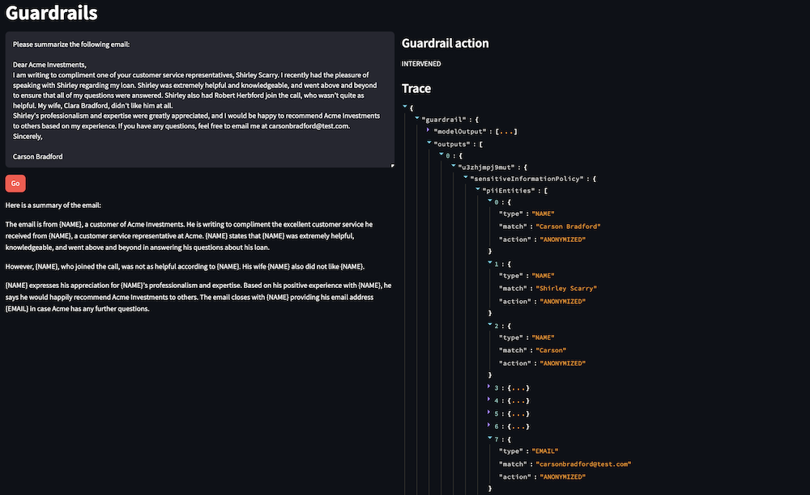

Final product:


## Lab introduction
In this lab, we will test some personally identifiable information (PII) masking scenarios with a basic Streamlit app.

Guardrails for Amazon Bedrock allows you to either block or mask sensitive information in the model’s response. You can use predefined patterns, or create your own patterns using regular expressions.

PII masking can be helpful when summarizing sensitive information, call transcripts, or other scenarios where you don’t want personal details to leak into the final output.

### Note
You can view the source code for this lab under the workshop/completed/guardrails folder, in the following files:

            create_pii_guardrail.py
            guardrails_app.py
            guardrails_lib.py

## Defining PII masking policies
See below for the relevant parameters of the create_guardrail method. You can see the full documentation for the create_guardrail method here: https://boto3.amazonaws.com/v1/documentation/api/latest/reference/services/bedrock/client/create_guardrail.html 

Learn more about sensitive information filters here: https://docs.aws.amazon.com/bedrock/latest/userguide/guardrails-components.html#guardrails-sensitive-filters 
 
## Sensitive information filters
PII filters are defined under the sensitiveInformationPolicy. In this section, you define how to handle personally identifiable information. For each entity type, you define whether to mask (“ANONYMIZE”) the PII or block (“BLOCK”) the response entirely. See below for the request syntax definition.

```python
sensitiveInformationPolicyConfig={
    'piiEntitiesConfig': [
        {
            'type': 'ADDRESS'|'AGE'|'AWS_ACCESS_KEY'|'AWS_SECRET_KEY'|'CA_HEALTH_NUMBER'|'CA_SOCIAL_INSURANCE_NUMBER'|'CREDIT_DEBIT_CARD_CVV'|'CREDIT_DEBIT_CARD_EXPIRY'|'CREDIT_DEBIT_CARD_NUMBER'|'DRIVER_ID'|'EMAIL'|'INTERNATIONAL_BANK_ACCOUNT_NUMBER'|'IP_ADDRESS'|'LICENSE_PLATE'|'MAC_ADDRESS'|'NAME'|'PASSWORD'|'PHONE'|'PIN'|'SWIFT_CODE'|'UK_NATIONAL_HEALTH_SERVICE_NUMBER'|'UK_NATIONAL_INSURANCE_NUMBER'|'UK_UNIQUE_TAXPAYER_REFERENCE_NUMBER'|'URL'|'USERNAME'|'US_BANK_ACCOUNT_NUMBER'|'US_BANK_ROUTING_NUMBER'|'US_INDIVIDUAL_TAX_IDENTIFICATION_NUMBER'|'US_PASSPORT_NUMBER'|'US_SOCIAL_SECURITY_NUMBER'|'VEHICLE_IDENTIFICATION_NUMBER',
            'action': 'BLOCK'|'ANONYMIZE'
        },
    ],
    'regexesConfig': [
        {
            'name': 'string',
            'description': 'string',
            'pattern': 'string',
            'action': 'BLOCK'|'ANONYMIZE'
        },
    ]
},
```
In our demo guardrail, we configure the sensitive information filter like below. We are telling the guardrail to mask anything that looks like either a name or an email address.
```python
sensitiveInformationPolicyConfig={
    "piiEntitiesConfig": [
        {"type": "NAME", "action": "ANONYMIZE"},
        {"type": "EMAIL", "action": "ANONYMIZE"},
    ],
},
```
## Create the guardrail
Select the bash terminal in AWS Cloud9 and change directory.
```
cd ~/environment/workshop/labs/guardrails
``` 
Run the create guardrails script.
```
python ~/environment/workshop/completed/guardrails/create_pii_guardrail.py
```
This should save the newly created guardrail ID to the appropriate setting in the local INI file.

The guardrail is now ready to be used by the guardrail testing app.

## Test the guardrail
Run the streamlit command from the terminal.
```python
streamlit run guardrails_app.py --server.port 8080 pii_masking_guardrail_id
```
Ignore the Network URL and External URL links displayed by the Streamlit command. Instead, we will use AWS Cloud9's preview feature.

In AWS Cloud9, select Preview -> Preview Running Application.


You should see a web page like below:


Try the following prompts. You can review the guardrail action and trace details in the right-hand column of the app.


Close the preview tab in AWS Cloud9. Return to the terminal and press Control-C to exit the application.