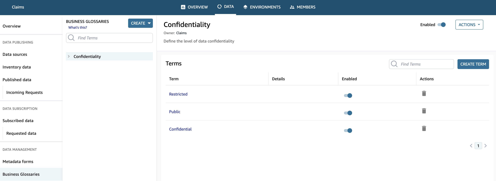
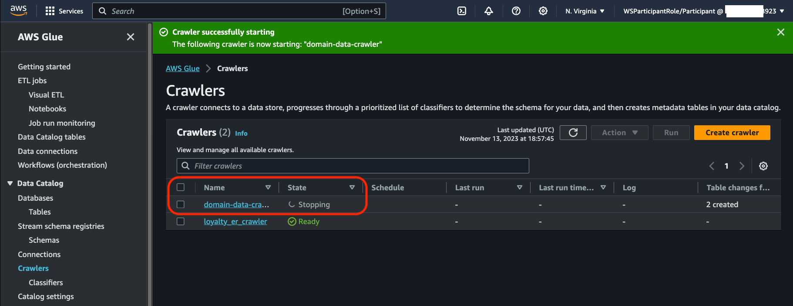
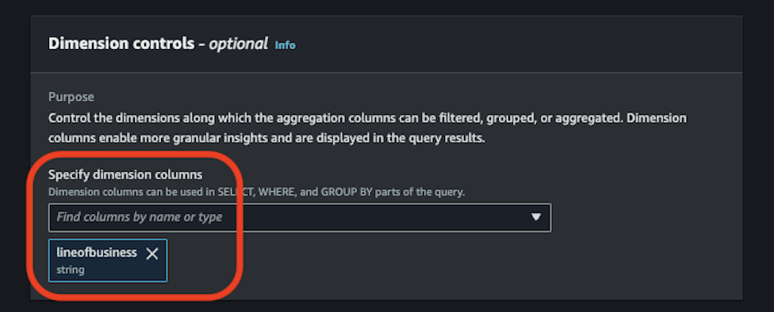
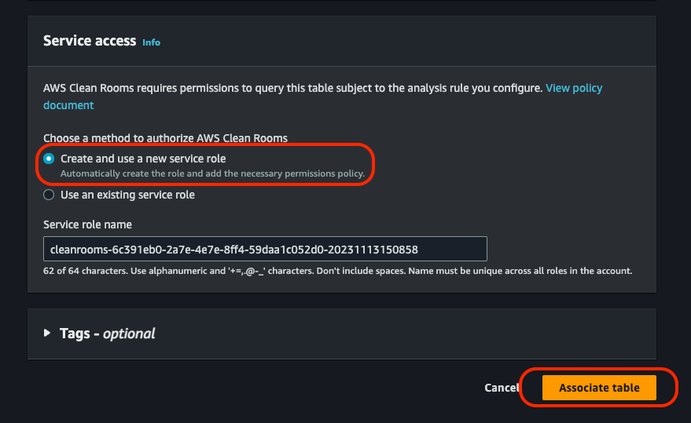
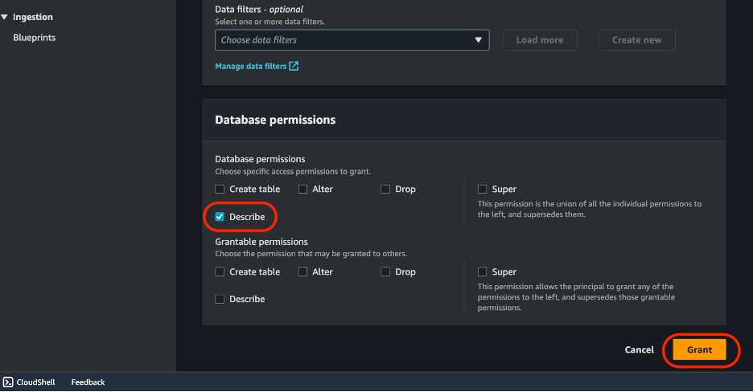
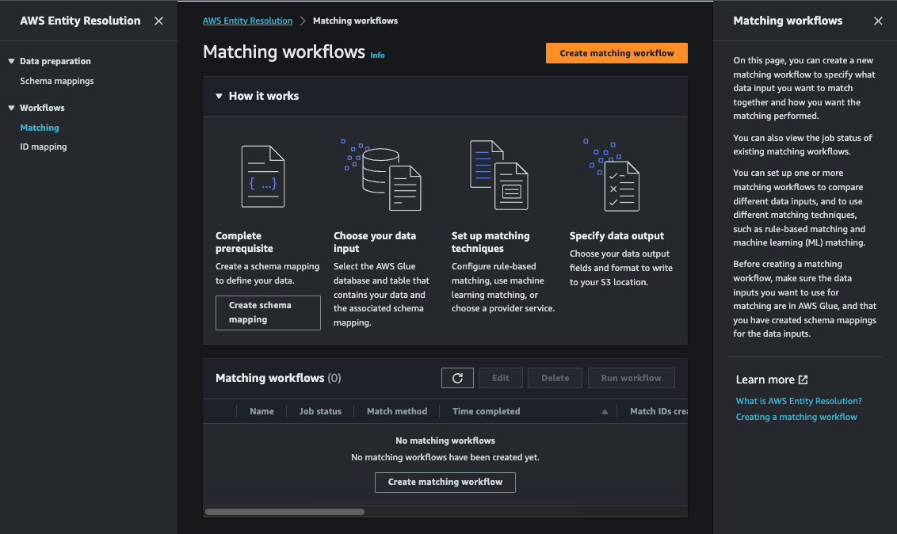
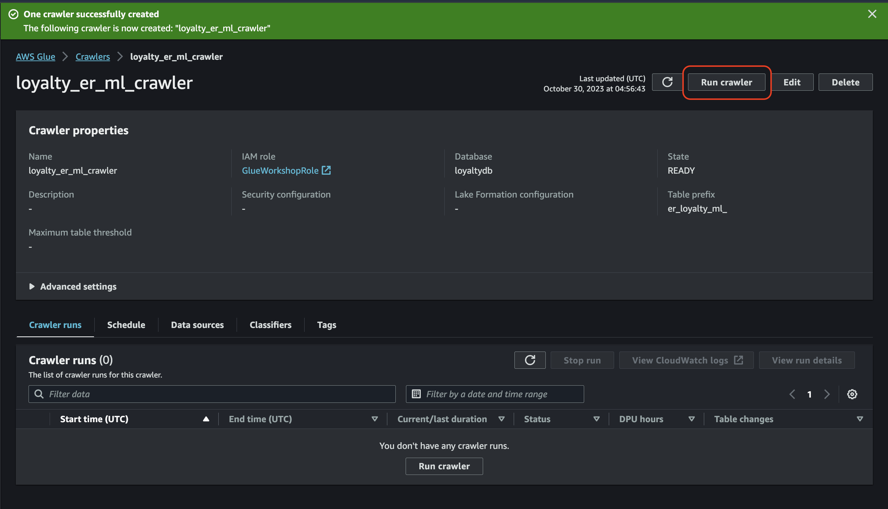

# 1. Introduction
Octank Insurance is customer obsessed, and they want to use their data to make the lives of their customers' better - lower premiums and lower risks mean happier customers and less claims. They know that data is the best way to do that, but haven’t been able to get value from their data - it’s locked away in multiple silos, and they’re worried about private and sensitive data being used by the wrong people. Additionally, the leadership identified that the claims volume have increased in a specific zip code year over year so they would like to understand what are the potential causes for it and what corrective actions cane be taken to mitigate them.


**Lab Outcome:** At the end of the labs, you would learn how to leverage the right purpose-built AWS services for building your Data Governance foundation. The labs will also help you decide how different personas interoperate within the different data governance domains to form data governance practices and processes.

To govern data effectively, several capabilities should be considered.

Curate – Organize and transform data to validate and improve quality and to semantically and technically link data derived from multiple sources

- `Master Data Management` – Manage the consistency and integrity of data associated with core entities (e.g., customers, products, suppliers)

- `Data Integration` – Transform data to enable technical and semantic linkage and consistency across business domains

- `Data Quality Management` – Identify and correct data defects that could impact business initiatives and operations

**Understand** – Provide descriptive information about data’s meaning, sources, transformations, stewardship, and other characteristics for end users and applications to navigate and leverage the data

- `Data Profiling` – Apply statistical and other methods to evaluate and report data demographics based on actual values

- `Data Catalog` – Enable data producers and consumers to share, find, navigate, understand, and access data for business use

**Protect** – Ensure that data is accessed and retained in a manner to meet business policies and regulations, especially considering sensitivity and integrity of the data

- `Data Security` – Ensure data is accessed only for authorized and obfuscated where required

- `Data Compliance` – Interpret and comply with laws and regulations related to the management of data

- `Data Lifecycle` – Retain data cost effectively to meet archival and access requirements


Here are the different personas we shall be considering for this workshop.

We are considering single domain corporate set up with 3 projects (claims, underwriting, marketing) owned by unique data steward.

**Producers:**

- Data Steward for Claims Project will own and publish Claims Dataset
- Data Engineer redacts sensitive data and Data Steward for Marketing project will own and publish Customer (redacted and cleaned) Dataset
- Data Steward for Underwriting project will own and publish policy Dataset

**Consumers:**

Data Analyst needs to analyse 3 datasets - Claims, Customer, Policy to find answer to why claims are increasing over the year.


The following diagram describes the solution architecture used for the workshop.


# 2. Practices
## 2.0. CloudFormation Template
- Before starting this lab, you need to create the required AWS resources. To do this, we provide an AWS CloudFormation template to create a stack that contains the resources. When you create the stack, AWS creates a number of resources in your account. The outcome of these steps is to create the Glue databases, Glue tables and other IAM resources that are needed.


- On the Specify stack details page, change the Admin ParticipantAssumedRole parameter, including the Admin User or Role you are using to run this Workshop and leave the other parameters with the default value and click Next


- On the Configure stack options page, leave everithing with the default values and click Next


- At the bottom of the Review DataZone-Module page, check the I acknowledge that AWS CloudFormation might create IAM resources with custom names and click on **Submit**


- Monitor the CloudFormation console and wait for the status to change to CREATE_COMPLETE as shown below.


Once the stack creation is completed, your AWS account will have all required resources to run this Module. Go to the Outputs tab to get the information necesary to run the labs that are part of the module.


## 2.1. Module 1: Understand, Unify & Curate
Ocktank leadership likes to make informed business decisions to mitigate business problems they encountered in the last quarter with data. Let’s understand how they can help address some of the data challenges and make the most of the data.


### 2.1.1. Data Profiling
In this lab, the Data Steward and Data Platform Lead are looking to make the data more useful for business decision-makers. Here, we will use Glue DataBrew to profile and understand the data and its quality.

Lab Architecture The following diagram describes the solution architecture of this lab.


#### Instructions
To create a DataBrew dataset, complete the following steps:

- Go to the [AWS Glue DataBrew](https://us-east-1.console.aws.amazon.com/databrew/home?region=us-east-1#landing) service.
- Select Datasets from the navigation menu on the left.
- Select Connect new dataset.


- For Dataset name, enter a name (for this lab, give Customers as name).
- Select Amazon S3 as service.
- For `Enter your source from S3`, enter the S3 path to the file. In our case, choose the bucket starting with dg-workshop-(for example- s3://dg-workshop-<your-AWS account ID>).
- Select the folder "customer" in the bucket. This will select all files under the folder.


- In the section Selected file type, choose CSV and for Delimiter, choose comma (,).
- Choose Treat first row as header in the Column header values section.
- Scroll to the bottom of the page and choose **Create dataset**.


You’re now ready to create your profile job to discover any PII columns.
- In the navigation pane, choose Datasets. Select the `Customers-2024` dataset.
- Choose `Run data profile` from top right as shown below.


Select `Create a profile job`. Name the job `Customers-2024 profile job`. While creating the job, for Data sample, select `Full dataset` as we would run the data profile on the *entire dataset*.


Scrolling down and in the Job output settings section, point to the profile-output S3 prefix where the data profile output is stored when the job is complete. In our case, this is `s3://dg-workshop-<your-AWS account ID>/`. Please append a `suffix` in end `profile-output/`. This will create a folder inside the bucket and save results in the folder.


Expand **Data profile configurations**, and select Enable PII statistics to identify PII columns when running the data profile job. Under `PII categories`, select All categories. Note: This option is disabled by default; you must enable it manually before running the data profile job.


- Keep the remaining settings at their default.


- In the **Permissions section**, choose Create new IAM role, and use `ID` as the role suffix.This creates a new IAM Role called AWSGlueDataBrewServiceRole-ID.


- Select Create and run job.


- This will take you to Data profile overview tab of the Customers dataset. It will display a job in progress as below while its running.


Once the job finishes, you will observe the different PII columns. You can decide which columns to redact or not. Please note we will be working on how to redact sensitive data in the next Lab section


You may repeat the same steps with `claims data` set. You can observe the data profile to evalaute the kind of **Data Quality** checks needed.


Summary of what you learnt in this lab At the end of the Lab the data Steward and Data Platform leader understood that the data have some quality challenges and some sensitive data which needs to be fixed before the data can be used by the Data Analysts and data consumers to maximize the value to help solve the problem.

### 2.1.2. Identifying and protecting sensitive data
In this lab, the Data Steward and Data Platform Lead needs to make sure any sensitive data contained within the dataset is identified and masked. This is required for regulatory and compliance reasons before the data can be made available for the Data Consumers.

Lab Architecture The following diagram describes the solution architecture of this lab.


In the following steps, we will create a Data Quality job in AWS Glue that will check records against 54 data quality rules. Once the Data Quality job finishes, the output of records will go in two tables. Successful records will be sent to a table'Pass' that the data analysts can query immediatly and failed records will be sent to seperate table 'fail' to be addressed by data owners.

- In the [AWS Glue Console](https://us-east-1.console.aws.amazon.com/glue/home?region=us-east-1#/v2/getting-started), click on `Visual ETL` on the `left navigation menu`.


- To create a new job, Click Visual ETL.


- Name your job **DQ_sensitive_data_detect** and assign IAM role on **Job Details** tab. Select the role `GlueWorkshopRole`.


- Click on Source and select **AWS Glue Data Catalog**


- Click on **data catalog** node and select **customerdb** for database and select `customer` table.


- Observe the schema of the customer table. Some of the columns which have to be redacted with an '*' may be Numeric data type. For example, `'Credit Card Number'`. So, we will convert data type for such columns from long to string. To achieve this, lets add a simple step to job i.e. `Change Schema` in the `AWS Glue job`. Click on action drop down located above the canvas and select **Change Schema**.


Change the datatype for column `c_creditcardnumber` from `long` to `string`.


- Let’s add our data cleansing action. Click on action drop down located above the canvas and select `Detect Sensitive Data`


- On the `'Detect Sensitive Data'` node, select `Find Sensitive Data` in each row. On `Types of sensitive information` to detect, select `Select specific Patterns`.


- For `Selected patterns`, Add `Email Address, Credit Card`. 


- Under `Actions`, Choose `REDACT. Redact detected text`. Keep the redaction text as default value.


- Next, Lets add a `Select Fields` action as shown in screenshot below.


- For `SelectFields`, select the first checkbox, so all fields will be selected as shown in screenshot below


- After that, `deselect` the `detectedentities` field as shown in screenshot below.


- Next, Lets add target as `Amazon S3` as shown in screenshot below.


- Next, Select your S3 bucket using the Browse S3 button and append to the path `/sensitive-data/` as shown in screenshot below. Choose format as `Parquet`.


For `Data Catalog update options`, choose **Create a table in the Data Catalog and on subsequent runs, update the schema and add new partitions**. Choose Database as `customerdb` and table as `customer_redacted`.

- Once done, Please save the job and click on run. Monitor the job until it finishes. Please note that this job run will take 2-3 minutes. Please wait until it finishes before you proceeed further.
- Let’s now inspect redacted records output with Athena.
- Search for the Athena service in the search bar and click on Athena


- In the Athena query editor first we need to setup our query results S3 bucket

> a) click on the edit settings button


> b) Enter the S3 path to the query results folder. `s3://dg-workshop-AWSACCOUNT#/athena-results/`. 


Keep everything else default and `save`.


- Goto `Athena query editor` and select the database customerdb and run the following query. If we inspect the results we can see valid credit card numbers and email addresses are redacted.

        SELECT * FROM "customerdb"."customer_redacted" limit 10;


Summary of what you learnt in this lab At the end of the lab, `Data Steward/ Data Engineer` will be able to identify and obfuscate the sensitive data from the dataset. This makes the data becomes compliant with data privacy and sensitivity guidelines to be available for broader distribution to `Data Consumers`.

### 2.1.3. Data Quality
In this lab we will learn how can Data Steward identify and recommend the data quality requirement of data. Data Engineer/Data Steward can see Fail records and identify the reason of failure and take actions accordingly.


### Instructions

In the following steps, we will create a Data Quality job in AWS Glue that will check our records against 54 data quality rules. When the job executes it will output the records in 2 different tables. Successful records will be sent to a table that the Data Analysts can query immediatly and failed records will be sent to seperate table to be addressed by Data Owners.

- In the [AWS Glue Console](https://us-east-1.console.aws.amazon.com/glue/home?region=us-east-1#/v2/getting-started), click on Visual ETL on the left navigation menu.


- To create a new job, Click `Visual ETL`.


- Name the job as `dg_workshop_dq`. Click on Source and select `AWS Glue Data Catalog`


- Click on data `catalog node` and select `claimsdb for database` and select the `claims table`


- Let’s add our data quality evaluation action. Click on action drop down located above the canvas and select `Evaluate Data Quality`


- Select the newly created Evaluate Data Quality node and Copy/paste the following data quality rules:

            Rules = [
                IsComplete "weekofmonth",
                ColumnValues "weekofmonth" <= 5,
                IsComplete "dayofweek",
                ColumnValues "dayofweek" in ["Friday", "Sunday", "Saturday", "Wednesday", "Thursday", "Tuesday", "Monday"],
                ColumnLength "dayofweek" between 5 and 10,
                IsComplete "make",
                ColumnValues "make" in ["Toyota", "Rivian", "BMW", "Kia", "Audi", "Tesla", "Honda", "Chevrolet", "Mazda", "Ford", "Accura"],
                ColumnLength "make" between 2 and 10,
                IsComplete "accidentarea",
                ColumnValues "accidentarea" in ["Urban", "Rural"],
                ColumnLength "accidentarea" = 5,
                IsComplete "dayofweekclaimed",
                ColumnValues "dayofweekclaimed" in ["Saturday", "Thursday", "Tuesday", "Monday", "Friday", "Sunday", "Wednesday"],
                ColumnLength "dayofweekclaimed" between 5 and 10,
                IsComplete "monthclaimed",
                ColumnValues "monthclaimed" in ["January", "July", "September", "October", "June", "August", "November", "April", "December", "May", "March", "February"],
                ColumnLength "monthclaimed" between 2 and 10,
                IsComplete "weekofmonthclaimed",
                ColumnValues "weekofmonthclaimed" <= 5,
                IsComplete "sex",
                ColumnValues "sex" in ["Female", "Male"],
                ColumnLength "sex" between 3 and 7,
                IsComplete "maritalstatus",
                ColumnValues "maritalstatus" in ["Single", "Married"],
                ColumnLength "maritalstatus" between 5 and 8,
                IsComplete "age",
                ColumnValues "age" between 16 and 100,
                IsComplete "vehiclecategory",
                ColumnValues "vehiclecategory" in ["Compact", "Cross-over SUV", "Sport", "SUV", "Sedan", "Truck", "Mini-van", "Mid-size Sedan", "Utility"],
                ColumnLength "vehiclecategory" between 2 and 15,
                IsComplete "fraudfound",
                ColumnValues "fraudfound" in ["0", "1"],
                ColumnValues "fraudfound" <= 1,
                IsComplete "policynumber",
                ColumnValues "policynumber" <= 10000000,
                IsComplete "repnumber",
                IsComplete "deductible",
                ColumnValues "deductible" in ["500", "1000", "5000", "3000", "300"],
                IsComplete "driverrating",
                ColumnValues "driverrating" in ["4", "3", "2", "1", "5"],
                ColumnValues "driverrating" <= 5,
                IsComplete "days_policy_accident",
                ColumnValues "days_policy_accident" in ["More than 30", "15-to-30"],
                ColumnLength "days_policy_accident" between 7 and 13,
                IsComplete "days_policy_claim",
                ColumnValues "days_policy_claim" in ["15-to-30", "More than 30"],
                ColumnLength "days_policy_claim" between 7 and 13,
                IsComplete "pastnumberofclaims",
                IsComplete "ageofvehicle",
                ColumnValues "ageofvehicle" in ["3 years", "4 to 6 years", "less than 3 year", "More than 6 years"],
                ColumnLength "ageofvehicle" between 6 and 18,
                IsComplete "policereportfiles",
                ColumnValues "policereportfiles" in ["Yes", "No"],
                ColumnLength "policereportfiles" between 1 and 4
            ]


- These rules will:

        - Ensure that we have no records with null values ie. IsComplete "weekofmonth"
        - Ensure strings match specific values ie. ColumnValues "accidentarea" in ["Urban", "Rural"]
        - Ensure we have a range for column lengths ie. ColumnLength "dayofweek" between 5 and 10
        - Ensure integer values are within a specific range ie. ColumnValues "age" between 16 and 100,

Scroll down to `“Data quality transform output”` section. When bad quality data is detected due to failed rules, we like to know which source records passed vs failed and for what rule. To accomplish this, select the checkbox `“Original Data”` and enable the toggle button `“Add new columns to indicate data quality errors”` shown in screenshot below. Also, uncheck the publish to Amazon Cloudwatch.


Above steps adds a new node on your canvas with the name rowLevelOutcomes. Click on the node and select the tab `‘Output Schema’` on the right hand pane. Scroll all the way down to notice the 4 audit columns added.


**DataQualityRulesPass:** Identifies records that have passed data quality checks

**DataQualityRulesFail:** Identifies records that have failed data quality checks and the attribute that failed

**DataQualityRulesSkip:** Some rule types such as row count are not applied at individual record level. This will show pass or fail

**DataQualityEvaluationResult:** This identifies the overall data quality result

- Click back on `Evaluate Data Quality node`. select the Data quality results and Publish results to Amazon CloudWatchcheck boxes. This will add a new node called `ruleOutcomes` to capture the cloudwatch logs and data quality rule metrics. Select from the drop down list under `“Data quality Actions”`, default configurations shows in screenshot below to let the job continue and complete when one or more data quality rules have failed.


- Lets write the rule metrics into an S3 bucket to allow further actions such as building dashboard to monitor data quality over time. From your `Canvas`, select the node ruleOutcomes and click on the dropdown tab Target. Then select `Amazon S3`.


Select your S3 bucket prefixed as `dg-workshop-[Account number]/metricout/` using the Browse S3 button as shown in screenshot below.


- Let's filter out data quality rule passed and failed records using ‘Conditional Router” transform. On your canvas, select the node named `‘rowLevelOutcomes’`, click on the Action drop down tab on top of the canvas and select Conditional Router as showin in screenshot below. Select rowLevelOutcomes node. Click on `Action and select Conditional Router`.


- We route all failed records to group named `Failed_records` group and let all good quality records to default_group On the right hand pane under Transform tab, rename `‘Group name”` from `output_group_1` to `“Failed_records”` and select the radio button logical operator `AND`. Click on Add Condition to choose the filter condition.


Now lets write the records that passed all data quality rules into a pre-created table for this lab named `"pass"` and all failed records to another pre-table named `"fail”`

> a) On your canvas, select the node named `‘default_group’` which has all passed records and click on the drop down tab Target, at the top of the canvas. Now select the target with name **AWS Glue Data Catalog** On the right hand pane in first tab, select from Database dropdown, `'dqresultsdb'` and Table dropdown ‘pass’. Leave rest of the fields as default.


> b) Now lets repeat the steps for failed records by selecting the node named ‘Failed_Records’ on your canvas and click the drop down tab named Target at the top of the canvas. Now select the target with name AWS Glue Data Catalog. On the right hand pane in first tab, select from Database dropdown, 'dqresultsdb' and Table dropdown ‘fail’.


- Glue Studio will automatically generate the code that you can view you can easily take this code parameterize it and reuse the same job for different data sources and data quality rules thus reducing your overall development time.

> a) On the top banner click on Script and inspect the job script


> b) Click on Job details and select the role prefixed with `'GlueWorkshopRole'`.


> c) Now let's save and run this job. You can monitor the job execution by clicking on the Run tab of the top banner. The job should complete successfully in a few minutes. Please wait until it finishes


- Let's check the data quality result. Click on the data quality tab. As you can see the data quality failed and the score is 96% for quality with 2 rules that failed. We observe that Rule_19 ColumnValues "weekofmonthclaimed" <= 5 and Rule_27 ColumnValues "age" between 16 and 100 failed


- Let’s now inspect our failed records output with Athena. Search for the Athena service in the search bar and click on Athena. Select workgroup 'AthenaLakeformation'. Then, select the dqresultsdb and run the following query:

            SELECT * FROM "dqresultsdb"."fail" limit 10;


- If we inspect the results we can see which data quality rule failed for each record. In the below example we see that the [ColumnValues "weekofmonthclaimed" <= 5] has failed, if we take a look at the "weekofmonthclaimed" value for this record it equals 7.


Summary of what you learnt in this lab At the end of the lab the data is cleansed with required data quality rules so that the data is high quality and consistent and value is improved to enable Data Consumers make better business decisions.

## 2.2. Module 2: Building a data Marketplace
#### How Amazon DataZone helps with Data Marketplace:

Amazon DataZone is a data management service that enables you to catalog, discover, govern, share, and analyze your data. With Amazon DataZone, you can share and access your data across accounts and supported regions. Amazon DataZone simplifies your experience across AWS services, including, but not limited to, Amazon Redshift, Amazon Athena, AWS Glue, and AWS Lake Formation. Use Amazon DataZone to discover and share data at scale across organizational boundaries with governance and access controls. Amazon DataZone makes data accessible to everyone in the organization.You can build a data marketplace with Amazon DataZone and achieve below functionalities:

- Catalog : Enable data producers to catalog data across business areas to make data more discoverable.
- Discover : Enable data consumers to search for and easily locate data assets in which they are interested.
- Govern: Enable data users to simplify access governance through separation of domains (data stewards), projects (consumers), and subscription approvals (producers).
- Share: Enable data producers to fulfill data consumers' requests for data access.
- Analyze : Enable data consumers to analyze the data to which they have access.

#### Amazon DataZone system Architecture

Use Amazon DataZone to share, search, and discover data at scale across organizational boundaries. Collaborate on data projects through a unified data analytics portal that gives you a personalized view of all your data while enforcing your governance and compliance policies


### 2.2.1. Skip Module 1 - Prelab setup for Datazone (Optional)
#### Instructions

In this lab, you need to create the required AWS resources. To do this, we provide an AWS CloudFormation template to create a stack that contains the resources. When you create the stack, AWS creates a number of resources in your account. The outcome of these steps is to create the Customer Redacted Table that are needed.

- Access `Cloud formation`, Then click on Next


- On the Specify stack details page, leave everithing with the default values and click Next


- On the Configure stack options page, leave everything with the default values and click Next


- At the bottom of the Review DG-Customer-Redacted-Table page, check the I acknowledge that AWS CloudFormation might create IAM resources. and click on Submit


Waiting for the result


Monitor the CloudFormation console and wait for the status to change to `CREATE_COMPLETE`. Once the stack creation is completed, your AWS account will have all required resources to run this Module.


### 2.2.2. Initial Set up of Data Marketplace
To set up a Data Marketplace, we will first create a domain as a one time activity. A DataZone Domain represents the distinct boundary of a Line of Business (LOB) or a business area within an organization that can manage their own data including their own data assets, their own definition of data or business terminology, and may have their own governing standards.A Domain is the starting point of a customer’s journey with DataZone. When you first start using DataZone, you start by creating a domain and all core components that exist within a domain.

Lab Architecture The following diagram describes the solution architecture with focus of this lab.


#### Instructions
In this step, you create the Amazon DataZone domain.

This process will also create a unique DataZone portal, which provides a business data catalog, as well as the interface for managing your DataZone environment.

#### Create Domain
- Login to the AWS Console as your administrator user, and make sure you are in the region selected for this workshop. Then navigate to Amazon DataZone  We will create domain as shown in documentation here .
- Click on the Create domain button.


- On the Create domain page, provide values for the following fields:

>>- **Domain Name**: For the purpose of this use case, you can name this domain as Corporate.

>>- **Description**: This is an optional field where you can provide a description for this root domain.

>>- **Service access**: Select the second option, and select the role AmazonDatazoneDomainExecutionRole. This role includes necessary permissions that authorize DataZone to make API calls on behalf of users within the domain.


- **Quick set up**: Select this option for the purpose of lab as it automatically creates required service roles and S3 bucket required for datazone set up for a datalake in Amazon S3. Select the Use an existing Service Role roles as shown in screenshot below. The roles are pre-created for this workshop.


- Leave all other options as default and click on Create domain. These roles assignment enables this domain to use resources within your account such as AWS Glue Data Catalog, Amazon Redshift, and Amazon Athena.

- On the sidebar, Click on Domains overview screen, there is a link next to the domain to open the data portal. Click on this link, which will open a new tab.


- This is the unique DataZone portal for your root domain, and can be used to manage your DataZone environmment, as well as access the data catalog. This portal is separate from the AWS Console, and can be integrated with corporate SSO platforms, enabling users in an organization to access DataZone without needing access to the AWS Console.

#### Create project for Publisher and Subscriber

In this step you are going to create a project  that aligns with different parts of your organization. Project is a construct that enables you to create business use case based grouping of people, data and analytics tools. Projects provide users a space where where members of the project are able to collaborate on a specific business use case. Within projects, you can create environments which provide the necessary infrastructure to project members such as analytics tools and storage so that project members can easily produce new data or consume data they have access to.

Make sure you are logged to the DataZone portal as your wsparticipant role (or an equivalent administrator role).

Once you open the portal, you will get a pop up as below. You can create project from here or follow the steps as shown below.


OR, On the top left, click on project.


- Create 3 projects:

        * a project with the name Claims. This is the Publisher project which publishes claims data.
        * a project with the name Marketing. This is the Publisher project which publishes customer data which was enriched to mask sensitive data (email and credit card number).
        * a project with the name Underwriting. This is the Publisher project which publishes policies data.


#### Create Environments
Once we have the project, we need to work with data and analytics tools in this project. For this we will create an [environment](https://docs.aws.amazon.com/datazone/latest/userguide/create-new-environment.html) . An environment profile is a pre-defined template that includes technical details required to create an environment such as which AWS account, region, VPC details, and resources and tools that are added to the project. Here you can see that DataZone automtically creates a couple of default env profiles for simplification.

- Go to the environment tab for the Claims project as shown below.


- Click on `“create environment”`, provide the name `DLEnvironmentforClaims`
- Select an `environment profile`. We will pick the data lake environment profile which enables you to publish data from your `Amazon Simple Storage Service (S3)` and `AWS Glue` based data lakes. It also simplifies querying the AWS Glue tables that you have access to using `Amazon Athena`. You can know more about Environment Profile here .
- Leave rest as default.


It take a about a minute for the environment to get created because in the background DataZone is creating certain resources in our AWS account. For example, IAM roles, which enables a project to act as an identity principal. Any access to the data is granted to the this identity principal instead of relying on the individual user identity. The environment also creates an Amazon S3 suffix, AWS Glue databases, an Athena workgroup, which simplify it for members of a project to produce and consume data in the data lake.


- Once enviroment is ready, observe that it gets associated with an option to create datasource and anaytic tools with Athena.


- Repeat same steps now to create environment for Underwriting project. Lets name Environment as `'DLEnvforUnderwriting'`.
- Repeat same steps now to create environment for Marketing project. Lets name Environment as `'DLEnvforMarketing'`.

#### Associate Project to IAM User
- Lets look at available IAM user. Goto AWS console and searh for IAM. Under IAM, you will see below users. Lets select dg-business-analyst-user.
- Now retrieve pwd from secrets manager from secrets mananger as shown below. 

        a) Goto AWS console and open secrets manager. 
        b) In secrets manager, open secret name 'data-governance-workshop-users-credentials'. Clik on retrieve secret value as shown below.


        c) copy pwd from password section as shown below:


- Next, Lets copy the account id from console as shown below and make a note of it


- Open the datazone data portal link in a new browser/incognito mode and 

        a. Login there using IAM mode


        b. Login with IAM user using account number, user as dg-business-analyst-user and password noted in earlier steps. Once its successfully logged in, then you may go back to original browser with admin account. Please make a note of the account id, user, and password on your side. We will be needing it in the last 2 labs in this chapter (Section 2.2.4 and 2.2.5).

- Now as an admin, lets add a member `dg-business-analyst-user` to the Marketing project. Goto tab Members at the top. Then click on Add Member on Marketing project as shown here.


- Choose member from dropdown. Note: Step 4 above is not done, then you wont see the IAM user in this drop down.


- Validate the member added sucessfully.


Summary of what you learnt in this lab At the end of the Lab the domain admin created the initial set up for a data givernance domain for a datalake in S3. We create project and enviroment for publisher and subscriber. We added a IAM User as a member to marketing project.

### 2.2.3. Publishing & Cataloging data product
Now that we have 3 projects created, each owner can create new data/ import existing data, catalog data and finally publish the same.

As a part of this lab, we will have below scenarios covered.

- 1. Marketing owns Customer Data. Data Steward will import existing customer master data that was redacted for sensitive data information. Then will make the data easy to understand with business glossary and business name generation.
- 2. Claims owns Claims Data. Data Steward will import existing claims data that was reviewed for data quality issues. Then will make the data easy to understand with business glossary and business name generation.
- 3. Underwriting owns policies Data. Data Steward will import existing policies data. Then will make the data easy to understand with business glossary and business name generation.

Lab Architecture The following diagram describes the solution architecture with focus of this lab.


#### Instructions
Now, let's learn how to import a dataset from Glue into DataZone, enrich catalog and publish the same. We will demonstrate here example for Claims. You will need to repeat the same steps for importing customer data in marketing, and policies data in Underwriting.

- 1. Let's import metadata for Claims dataset from Glue Catalog. Click create data source as shown below.


- 2. Set name as Claims and data source type as AWS Glue.


- 3. Select environment we created for claims project - `DLEnvironmentforClaims`.
- 4. Type the Database Name as claimsdb and click Next. Pls note claimsdb wont be available by default in dropdown. You need to type in `claimsdb`.


(Note: this database and tables under it has been auto created for you for this workshop.)

- 5. Next, we define publish settings for the asset to the catalog. Let's keep all default settings and click Next.


- 6. Select Run on Demand for scheduling the sync up of data asset schema from Glue and click Next.


- 7. Review all settings and **Create Data Source**.


- 8. Once data sources are created succesfully, we will run them to get the data asset created in Inventory of data assets. Refresh to see the status of run completed.


- 9. Repeat the steps 1 to 8, For Marketing project, create a data source for customer_redacted data from database name customerdb in Glue catalog.
- 10. Repeat the steps 1 to 8, For `Underwriting project`, create a data source for `'Policies`' data from database name `policydb` in `Glue catalog`.
- 11. Validate that 2 customer tables are created as below under Marketing project.


Validate that policies table created as below under Underwriting project.


- 12. Once data asset is created, you can view it in inventory tab as shown below.

> `Claims - claims`


> `Marketing - customer`


> `Underwriting - policies`


- 13. The tables created have technical column names. DataZone offers a feature called Business Name Generation. This feature helps to convert technical names to business data names. You can review the names and if all looks good, you can click on Accept All for business data name auto generation.


- Click on `'Claims'` - table name. Now you, as a data steward/data product owner, can enrich the data asset with `Readme` about the data, add more business glossary and add `metadata form`. Once done, click on publish to publish this data asset for consumption. You will be prompted with a pop up to Publish dataset - Click `'Publish Dataset'`.
- Repeat step 12 for `'Customer_redacted'` and `'Policies'` as well.

> `Claims - claims`


> `Marketing - customer`


> `Underwriting - policies` 


As a data steward, I have published data. We will validate data in next lab 2.3

#### Business Catalog
Now, let's learn about enhancing business catalog.

The data classification can be performed using [Business Glossary](https://docs.aws.amazon.com/datazone/latest/userguide/datazone-concepts.html) and [Metadata Form](https://docs.aws.amazon.com/datazone/latest/userguide/datazone-concepts.html)

#### Business Glossary
In Amazon DataZone, a [Business Glossary](https://docs.aws.amazon.com/datazone/latest/userguide/datazone-concepts.html) is a collection of business terms that may be associated with data assets. Business glossaries are created in the catalog root domain by a root domain data steward, and can then be attached to metadata forms associated to other domains. A business glossary can be a flat list of terms, or a hierarchical list, where any term in the business glossary can be associated with a sublist of other terms.

- 1. In the Amazon DataZone Data Portal, Goto Claims project and goto data tab, choose Business glossaries, and then click Create glossary.


- 2. Specify a business glossary name and a description for the business glossary and then choose Create glossary.

                Create a business glossary with the name Confidentiality and the following description Define the level of data confidentiality


- 3. Create Terms in the business Glossary `'Confidentiality'` by clicking `Create Term`.


Create a `Term` with the name `Confidential` and leave rest default. 


Create a `Term` with the name `Public` and leave rest default.

Create a `Term` with the name `Restricted` and leave rest default.



- 4. Next, let's apply this business glossary to `'Underwriting'` project and add the glossary to policies dataset.


Select `Confidential` to update glossary


5. View the applied `Glossary` as below.


#### Metadata forms [Optional]
[Metadata forms](https://docs.aws.amazon.com/datazone/latest/userguide/create-metadata-form.html)  define the metadata that is collected and saved when data assets are published in a domain. Metadata forms are created in the Amazon DataZone root domain by a root domain data steward. A metadata form definition is composed of one or more field definitions, with support for boolean, date, decimal, integer, string, and business glossary field value data types.

- 1. In the Amazon DataZone Data Portal, expand Catalog management, choose Metadata forms, and then choose Create metadata form. For this example in this lab, let's create a metadata form in Marketing Project for identifying the Ownership of the data asset.


- 2. Specify the metadata form name, technical name and description, and then choose Create metadata form as shown below. Make sure to enable the form for it to be usable


- 3. To create a new field within the metadata form, choose Create field, then specify the field name, field type, and description, and then choose **`Create field`**.

Create a field Business SME with the name shown below and rest shown below.


Similarly create another field for `Technical Owner`.


Once Metadata form is ready, Enable the form 'Ownership as demonstrated below. This will enable the form to be available to attach to projects.


The **Metadata form** can be applied to any data asset in a project. To apply metadata form in your Amazon DataZone project, you must have admin permissions for that domain.

- 1. In the Amazon DataZone Data Portal, Goto Claims project and go to data tab, choose published dataset and click on data asset you published in lab earlier. Navigate as shown below and click Add Metadata Form


- 2. Select the metadata form Ownership that you want to apply from the drop-down list and then choose Add.


- 3. Then the fields are available for adding more info as needed. By default, they are optional but you may make it required as neccesary.

Please note that the Business Glossary or the Metadata form created will be applicable in all the data assets that belong to the domain Corporate.

Summary of what you learnt in this lab At the end of the Lab the Data Steward/ Data product owner was able to sucessfully create a data asset and publish the same for other consumers to consume. Additionally we learnt how to enrich the data catalog with Business Gloassary and Metadata forms.

### 2.2.4. Discovering and subscribing data product
Data Consumer / Data Analyst searches for data and discovers the data needed for the business use case. They also request access to the data through data subscription. Once the Data Product Owner approves the subscription, the data asset is available for use by the Data Analyst.

In earlier lab, you published Data Asset for claims and customer. Now, you can search for these assets and subscribe to them in this lab.

**Lab Architecture** The following diagram describes the solution architecture with focus of this lab.

In this lab, we will view subscription process as `'WSParticipant_role'` which you have been using all thru so far. and then we will see how you can switch to a IAM user and subscribe the project. We will subscribe:

- `Claims` dataset from `claims project`
- `customer_redacted` dataset from `marketing project`
- `policy` dataset from `underwriting project`

#### Instructions
- 1. Open a new browser or incognito mode for a new session. Here open AWS login [console](https://console.aws.amazon.com/console/home?nc2=h_ct&src=header-signin) .
- 2. Login with IAM User. Use the account number, user as `'dg-business-analyst-user'` and password noted in lab 2.1.
- 3. Once logged in, Open Data portal URL from other console and click on login using IAM.
- 4. Once you are in Data Portal, Select Marketing project and then Search for data asset `'claims'` using keywords `'claims'` in the data portal search bar at the top as shown below. 


- 5. if necceasary, apply filters or sorting, and once you locate the `'claims'` data asset, you can click it to open the asset detail page.
- 6. On the data asset page, click on subscribe button, a dialog will appear, click `'subscribe'`. 


- 7. In the dialog, select your marketing(consumer) project from the drop down and provide reason for access. for example


            subscribe claims to analyse the data asset for marketing team

- 8. Click on subscribe. 


- 9. Switch to producer role(admin for this lab in other browser), Go to Claims project. Then go to the data tab-> Published Data -> Incoming request-> view request link and approve the subscription. 


- 10. Please wait for 2-3 minutes for Grant to be completed to provison access to claims table.

Repeat same 1-7 steps for subscribing to 'customer_redacted' and 'policy' datasets.

- 11. We will analyze the subscribed dataset in next lab.

Summary of what you learnt in this lab As a part of this lab, you learnt about how to discover dataset and then subscribe for perfromaing analysis. We will view and analyze data in next lab 2.4 (section 2.2.5).

### 2.2.5. Analyze and Visualize data in Athena
In this lab, we shall be analaysing datasets that we subscribed from different projects and consume them in Marketing project for analysis.

Our Analyst needs to find all claims that were created by individuals who are less than or equal to 18.

Lets Understand datasets:

- 1. Customer: This dataset provided customer info like his age and other attributes.
- 2. Policy: This dataset provides policy id and other poilcy attributes taken by a customer in customer dataset.
- 3. Claims: This dataset provides a policy which have submitted a claim. It has other claim details.

Lab Architecture The following diagram describes the solution architecture with focus of this lab.


#### Instructions
1. Go to DataZone portal, open overview and click on query Data. Click on 'Query Data' as shown below.


2. It will prompt you to open Amazon Athena. Click Open Amazon Athena. It will pop up a new window. Make sure you allow popups in your browser.


3. Choose the athena DB 'dlenvformarketing_sub_db'. This is db created based project- environment we created in lab 2.2 for Marketing.


4. In database 'dlenvformarketing_sub_db, you would see the 3 tables - customers, claims, policy as shown below.


5. Use below SQL to view all claims that were created by individuals who are Teenagers (less than 18).


Summary of what you learnt in this lab At the end of the lab, as Data Analyst of Claims department, you were able to combine data from Marketing and Underwriting departments and create a combined report to analyse one of the reasons of increase in number claims mainly coming from teenagers. The rise in more teenage drivers is resulting in rise in claims. This analysis can help you take business decisions fast enough with help of Amazon DataZone.

## 2.3. Module 3: Security and Compliance
AWS Lake Formation easily creates secure data lakes, making data available for wide-ranging analytics. With Lake Formation, you can:

- Create, administer, and protect data lakes using familiar database-like features quickly.
- Simplify security management and governance at scale, and enable fine-grained permissions across your data lake.
- Break down data silos and make all data discoverable with a centralized data catalog.
- Support organization-wide data accessibility at scale with cross-account data sharing.

### 2.3.1. Goals
The purpose of this lab is to demostrate how you can use AWS Lake Formation fined grained access controls to make data accessible and usable while securing senstive data elements. The lab should take approximately 15 minutes to complete

#### Scenario
In this example, we'll focus on how to protect particularly sensitive data, which the organization is not yet ready to share across the organization. Consider an Employee dataset, which contains sensitive salary information for all employees. A simple version of the data looks as follows:


While there's a lot of value in this data to the business, there are a few key requirements:

1. Salary information is confidential, and must not be shared outside of authorized HR representatives.
2. Authorized HR representatives can view salary information only where there's a defined business need. In our example, we have regional HR representatives: North and South, and HR representatives must only be able to see salary details for employees within their regions.

#### Architecture
TBD

#### Setup
The CloudFormation template has pre-created the following:

- S3 Bucket :
>- `${AWS::AccountId}-${AWS::Region}-hrdata` - this will hold our Employee data.
>- `${AWS::AccountId}-${AWS::Region}-lflabqueries` - this will hold the results of our Athena queries.
- IAM Roles:
>- `HRRep-RegionalSouth` - we will grant permission to view data only for employees in the South region.
>- `HRRep-RegionalNorth` - we will grant permission to view data only for employees in the North region.
>- `Analyst` - we will grant permission to view non-sensitive data for all regions.
>- `GlueWorkshopRole`
- Glue Table : employees
- Glue Database : hr
- Athena Workgroup : defines settings for use with Amazon Athena queries.
- Various Lake Formation permissions.

### 2.3.2. Column / Row Level Access with Lake Formation
#### Load the Employee sample data
We need to populate some sample data into our Employees table.

1. In the AWS Management Console, navigate to **AWS CloudShell**.


2. Copy and run the following statements:

                awsregion=$(aws configure list | grep region | awk '{print $2}')
                accountid=$(aws sts get-caller-identity --query "Account" --output text)
                aws s3 cp s3://ws-assets-prod-iad-r-cmh-8d6e9c21a4dec77d/1bf9302a-862c-4e21-9e45-c81fa055643b/v1_0/employees.csv ./employees.csv
                aws s3 cp ./employees.csv s3://$accountid-$awsregion-hrdata/employees/employees.csv

- The first step takes the region being used.
- The second step takes the `AccountID`.
- The third and fourth steps copy the employee dataset to the location used by the `employee` table.

3. Navigate to AWS Athena in the AWS Management Console. If this is the first time using Athena, leave Query your data with Trino SQL selected, and click Launch query editor


4. In the Workgroup dropdown in the top right hand corner, select the AmazonAthenaLakeformation workgroup.


5. Acknowledge the settings.
6. Execute the following query to verify the data loaded into the table.

            SELECT * FROM "hr"."employees" limit 10;


#### Grant Column Level Access for the Analyst
Next, we are going to grant the required fined grained access controls for our various roles. First, we will grant permission for the Analyst to select all records from the employee table except the senstive Salary data.

7. Navigate to Lake Formation in the AWS Management Console.
8. On the Data lake permissions page, press Grant.


9. Under IAM users and roles, select the `Analyst` role


10. Select Named Data Catalog resources.
11. In the Databases dropdown, select the hr database.
12. In the Tables dropdown, select the Employees table.


13. Under Table permissions, mark the checkboxes next to Select


14. Leave **Grantable permissions** empty.
15. Under **Data permissions**, select Column-based access
16. Select **Exclude columns**
17. In the **Select columns** dropdown, select annualsalary


18. Click **Grant**.

#### Grant Row Level Access for the North region HR representatives.
19. In the Lake Formation console, select Data filters from the navigation pane.
20. Click `Create new filter` or `Create data filter`.
21. For `Data filter name`, enter `NorthRegion`
22. For `Target database`, select the `HR database`.
23. For `Target table`, select the `employees` table.
24. For `Column-level access`, select `Access to all columns` option.
25. For Row filter expression, enter `Region='North'`


26. Click Create filter.
27. Select the newly created North Region filter, then click Grant permissions.


28. In the IAM users and roles, select the `HRRep-RegionalNorth role`.
29. Under Data filter permissions, mark the checkbox next to Select. Leave grantable permissions unselected.


30. Click Grant

### Optional - Grant Row Level Access for the South region HR representative
31. You can repeat steps 20-30 above to apply row level permissions for the South region HR representative. This is optional.


#### Query the data
Next, let's switch the Analyst
32. Expand the dropdown in the top right hand corner, and click the copy button next to the Account ID.
33. In the same dropdown, select Switch Role


34. Paste the Account ID you just copied under Account
35. Enter Analyst, then click Switch role.


36. As the Analyst, navigate to Amazon Athena.
37. Switch to the AmazonAthenaLakeformation workgroup and click Acknowledge.
38. Execute the following:

            SELECT * FROM "hr"."employees"

39. Note that the AnnualSalary column is not show, since we've excluded that column from the permissions in Lake Formation.
Next, let's do the same as the HRRep-RegionalNorth role.

40. Open the dropdown in the top right hand corner of the console, and click Switch back.


41. Next, repeat steps 32-38 above, but this time using HRRep-RegionalNorth
42. Execute the following:

            SELECT * FROM "hr"."employees"

43. Note that only records from the North region are shown.
44. If you configured the data filter for the South region earlier, you can repeat the steps above for the HRRep-RegionalSouth role.

### Wrapping Up
Congratulations, you have now completed this lab. In this lab, you:
- Configured column level access to Employee data for the Analyst role
- Configured row level access to Employee data for the regional HR representatives.

# 3. Advanced-Labs
## 3.1. AWS Clean Room
Companies across multiple industries, such as advertising and marketing, retail, consumer packaged goods (CPG), travel and hospitality, media and entertainment, and financial services, increasingly look to supplement their data with data from business partners, to build a complete view of their business. At the same time, they also want to protect sensitive consumer information and eliminate the sharing of raw data.

AWS Clean Rooms is a new service that makes it easier for you and your partners to analyze and collaborate on your collective datasets to gain new insights, without sharing or copying one another’s underlying data or having to move it outside of AWS. You can use AWS Clean Rooms to create your own clean rooms in minutes, and start analyzing your collective datasets with just a few steps.


In this lab, we will experience how to use AWS Clean Rooms to easily create a secure data clean room on the AWS Cloud in minutes and collaborate with your partners. You can use a broad set of built-in, privacy-enhancing controls for clean rooms. These controls allow companies to customize restrictions on the queries run by each clean room participant, including query controls, query output restrictions, and query logging.

### 3.1.1. Preface
#### Goals
- Setup Your Own Clean Rooms
- Collaborate with your partners without Moving Data Outside AWS
#### Time to complete
The lab should take approximately 30 minutes to complete

The Insurance company is using an advertiser to push advertisements to passengers to increase sales attainment. After placing the advertisement, the Insurance company wants to measure the impact of each Advertising Campagin. In specific, the number of insurance policies resulted from marketing campaign. The Advertiser also wants to understand the impact of the marketing campagin better such as the Most Effective Creative Type for each age group (to make the next advertising campaign more effective). In order to achieve this, the Insurance Company and the Advertiser must collaborate with each other on the dataset each of them owns.

The following illustrates the steps through this lab:


#### Insurance Data Steward
1. Load data into an S3 bucket - this includes both customer and policy data. (customer and policy data have been copied by the CloudFormation deploy at the beginning of the workshop)
2. Run a crawler - creates the customers and policies tables in the AWS Glue catalog.
3. Create a collaboration - in AWS Clean Rooms, create a collaboration with the advertiser account.
4. Associate the customers and policies tables in the collaboration.
5. Configure an analysis rule - defines the queries the advertising account is allowed to execute.

#### Advertising Collaborator
1. Load data into an S3 bucket - this includes advertisement impressions data.
2. Run a crawler - creates the adimpressions tables in the AWS Glue catalog.
Join the Collaboration
3. Associate the adimpressions table with the collaboration.
4. Query the data - create a join between the advertising and adimpressions data.

### 3.1.2. Configure Datasets
#### AWS Accounts
The workshop facilitators will provide you with 2 AWS Accounts:

- 1 AWS Account for Insurance Company **(Account-A)** - this is the account you will log into via Workshop Studio.
- 1 AWS Account ID for the Advertising Company **(Account-B)**.

You will use a cross account role switch to switch between the two accounts to complete this lab.

#### Setting up the Underlying Datasets
In this scenario, the insurance company wants to share their customer data with an external advertising agency to build more targetted campaigns; however, they need to be able to share this data, without compromising on private or sensitive information.

1. To set up the data lakes for collaboration, this workshop has pre-provisioned the following resources for you to use in the lab in AWS Account for Insurance Company (Account-A)

- S3 bucket with below csv files

                customer data: dg-workshop-cr-<_Aws_Account_Id>/customers/customers.csv
                policies data: dg-workshop-cr-<_Aws_Account_Id>/policy/policies.csv
                IAM role with access to S3 bucket - GlueWorkshopRole
                Database in Glue Data Catalog - domaindb

2. Using a glue Crawler - domain-data-crawler, we will populate the Glue catalog domaindb with below tables:                

                    Table-1: customers
                    Table-2: policies

3. Create AdverstingCollaborator role in the advertising company's AWS account (Account-B).
4. Again, from (Account-A), we will perform role switch into the AdverstingCollaborator role in the advertising company's AWS account (Account-B).
5. However, in AWS Account ID for the Advertising Company (Account-B), we will have to set up our data lakes for collaboration and we need to complete the following:                    

                Prepare advertisting impressions data in the Advertising Company's data lake.
                Copy ad impressions data to an S3 bucket
                Use a crawler to populate the Glue catalog

#### Default permissions for new tables in Insurance Account
1. Navigate to [Databases](https://us-east-1.console.aws.amazon.com/lakeformation/home?region=us-east-1#databases) in AWS Lake Formation Console. Select `domaindb` and `Edit`


2. Select Use only IAM access control for new tables in this database and Save


#### Preparing the Insurance data lake.
1. Navigate to Amazon S3  in the AWS Management Console.

2. Click on S3 bucket `dg-workshop-cr-<_Aws_Account_Id>` and validate below files:

            customer data: dg-workshop-cr-<_Aws_Account_Id>/customers/customers.csv
            policies data: dg-workshop-cr-<_Aws_Account_Id>/policy/policies.csv


3. Navigate to AWS Glue  in the AWS Management Console.
4. Select Crawlers in the natigation pane, and select the `domain-data-crawler`.


5. Click Run, and wait for the crawler to complete - the state with be either Ready or Stopping. Note that 2 tables should have been added to the Glue Data Catalog.




6. Select Databases under Data Catalog section in the left pane.


7. Click on `domaindb` and validate below tables:

                Table-1: customers
                Table-2: policy

8. In the top right hand corner of the AWS management console, expand the drop down for the WSParticipantRole and copy the Account ID.


### Creating AdverstingCollaborator role in Account-B
9. Open incognito window or different browser to Access the Advertising Company AWS Account.
10. Navigate to AWS Identity and Access Management   in the AWS Management Console.
11. Click on Roles under Account Management in the left pane, and choose Create role


12. Choose Custom trust policy, enter the following trust policy and click Next

                {
                    "Version": "2012-10-17",
                    "Statement": [
                        {
                            "Effect": "Allow",
                            "Principal": {
                                "AWS": [
                                    "arn:aws:iam::<_Aws_Account_Id>:role/WSParticipantRole"
                                ]
                            },
                            "Action": [
                                "sts:AssumeRole"
                            ]
                        }
                    ]
                }


13. In Add permissions page, choose the policy AdministratorAccess and cick Next
14. Provide following details and click Create role.                

                Role name: AdverstingCollaborator
                Description: Cross account role with admin access 


15. Copy the AWS Account ID of the `Account-b`                


16. Close the incognito window or the current browser tab from which you have accessed the **Advertising Company AWS Account (Account-B)**.

#### Preparing the Advertising data lake.
17. In the top right hand corner of the AWS management console, expand the drop down for the WSParticipantRole and click Switch role.


18. Enter the Account ID for the Advertising company (Account-B) and enter AdverstingCollaborator under Role.


19. Click Switch Role to federate into the Advertising company account.
20. As the AdverstingCollaborator role in (Account-B), navigate to Cloud Shell.


21. When ready, execute the following statement:

            curl 'https://ws-assets-prod-iad-r-iad-ed304a55c2ca1aee.s3.us-east-1.amazonaws.com/1bf9302a-862c-4e21-9e45-c81fa055643b/v1_0/ad_impressions.csv' --output adimpressions.csv 
            aws s3 cp adimpressions.csv s3://dg-workshop-cr-<_Aws_Account_Id>/adimpressions/adimpressions.csv


22. Navigate to AWS Glue  in the AWS Management Console.
23. Select Crawlers in the natigation pane, and select the advertising-data-crawler.


24. Click Run, and wait for the crawler to complete - the state with be either Ready or Stopping. Note that 1 table should have been added to the Glue Data Catalog


#### Return to the Insurance Company account
25. In the top right hand corner of the AWS management console, expand the drop down for the WSParticipantRole.
26. Click Switch back to return to the original account.


### 3.1.3. Configure Collaboration - Insurance
An AWS Clean Rooms collaboration is secure logical boundary in which members can perform SQL queries on configured tables. Collaborations are created by the collaboration creator. Only members who have been invited to the collaboration can join the collaboration. A collaboration can have only one member who can query data and receive results. All members can see the list of invited participants in the collaboration before they join the collaboration.

In this section you will create a collaboration.

#### Create Collaboration
1. As the WSParticipant role in the Insurance account, navigate to [AWS Clean Rooms](https://us-east-1.console.aws.amazon.com/cleanrooms/home?region=us-east-1)
2. Click Create collaboration


3. Enter the following collaboration details and click Next

| Field                                     | Values                                        |
|-------------------------------------------|------------------------------------------------|
| Name                                      | `Insurance-Advertiser-Collaboration`          |
| Description                               | `Insurance Advertiser Collaboration`          |
| Member 1: Member display name             | `Insurance Company`                          |
| Member 2: Member display name             | `Advertising Company`                         |
| Member 2: Member AWS Account              | `AWS Account id of Advertising Company`       |
| Member Abilities: Member who can query and receive results | `Account ID of the Advertising company`       |
| Query logging: Support query logging in this collaboration | `check`                                        |


4. In Configure membership, turn on Query Logging and leave other configrations as default


5. Click Next and select Create collaboration and membership


#### Create Configured Tables
Each configured table represents a reference to an existing table in the AWS Glue Data Catalog and data stored in Amazon S3 that has been configured for use in AWS Clean Rooms. A configured table contains an analysis rule that determines how the data can be used in AWS Clean Rooms queries.

#### In Insurance Company AWS Account

1. Click on Configured tables in the Clean Rooms navigation pane.
2. Click Configure new table


3. Select domaindb as database and table to be customers
4. In Columns allowed in collaborations, select All columns and click Configure new table


5. Repeat the steps above for table policies


#### Configuring a Customer analysis rule
1. Navigate to Configured Tables  and select customers
2. Select Configure analysis rule


3. Select List as Type and click Next


4. Choose c_name as the Join Columns
5. Under List controls, select the following columns:

| c_age | c_city | c_country | c_gender | c_postcode | c_state | c_customer_id |
|-------|--------|-----------|----------|------------|---------|---------------|
|       |        |           |          |            |         |               |


6. Click Next, then Configure analysis rule

#### Configuring a Policies analysis rule
1. Navigate to Configured Tables  and select policies
2. Click Configure analysis rule


3. Leave Aggregation selected, and click Next


4. For the Aggregate function, choose AVG, and select the following columns:


5. Under Join controls, select Yes under Allow table to be queried by itself.
6. Under Specify join columns - optional, select c_customer_id.


7. Under Dimension controls, select lineofbusiness and click Next.



8. Under Aggregation constraints, select any of the aggregate columns (e.g. accidentyearbasicincurredamount) and enter a value of 100.


9. Click Next, then Configure analysis rule.

#### Associate configured table to collaboration
1. On the customers table, click Associate to collaboration.


2. Select the Insurance-Advertiser-Collaboration and click Choose collaboration.


3. Under Service access, select Create and use a new service role.


4. Click Associate table.
5. Repeat for the policies table


### 3.1.4. Configure Collaboration - Advertising
#### Join Collaboration
1. Switch to Advertising account (Account-B).


2. Navigate to AWS Clean Rooms, and select Collaborations from the navigation pane.
3. Click on the Available to join tab.
4. Select Insurance-Advertiser-Collaboration


5. Review the collaboration details, and click Create membership


6. Make sure you turn on Query logging


7. Under Query results Setting defaults, set Results Destination in Amazon S3 as `s3://dg-workshop-cr-<_Aws_Account_Id>/query-results`


8. Click on Create Membership


#### Associate Tables
1. Navigate to the Configured tables, and click Configure new table


2. Select drivingdatadb database, table adimpressions


3. In Columns allowed in collaborations, select All columns and click Configure new table


#### Configure Analysis rule
1. Click Configure analysis rule


2. Select List as Type and click Next


3. Choose c_name as Join Columns


4. Click Next and Configure analysis rule

#### Associate configured table to collaboration
1. On the adimpresssions table, click Associate to collaboration.


2. Select the Insurance-Advertiser-Collaboration and click Choose collaboration.


3. Under Service access, select Create a new service role.



4. Click Associate table.


### 3.1.5. Queries
1. As the AdvertisingCollaborator role, select the Insurance-Advertiser-Collaboration collaboration.


2. Under Queries tab, go to Analysis section


3. Execute the following query:

```sql
SELECT  AVG("policies"."accidentyearbasicincurredamount"),
	AVG("policies"."accidentyearexcessincurredamount"),
	AVG("policies"."accidentyeartotalincurredamount"),
	"policies"."lineofbusiness"
FROM  "policy" as "policies"
GROUP BY "policies"."lineofbusiness";
```


4. Below query joins the customers table from account-A with adimpressions table from account-B.


Execute the following query:

```sql
SELECT DISTINCT "customers"."c_age",
		"customers"."c_city",
		"customers"."c_country",
		"customers"."c_gender",
		"customers"."c_postcode",
		"customers"."c_state"
FROM  "customers"
INNER JOIN  "adimpressions"
	ON  "customers"."c_name" = "adimpressions"."c_name"
```


## 3.2. AWS Entity Resolution
Companies across multiple industries, such as advertising and marketing, retail, consumer packaged goods (CPG), travel and hospitality, media and entertainment, and financial services, increasingly look to accurately link and enhance related records of customer information, product codes, or business data codes. At the same time, they are looking to improve matching accuracy and protect data security while minimizing data movement.

AWS Entity Resolution makes it easier for you to match, link, and enhance related records stored across multiple applications, channels, and data stores. You can get started in minutes using configurable entity resolution workflows that are flexible, scalable, and seamlessly integrate to your existing applications. AWS Entity Resolution offers advanced matching techniques such as rule-based, machine learning (ML)-powered, and data service provider matching.


Configurable entity matching workflows - An entity matching workflow is a sequence of steps you set up to tell AWS Entity Resolution how to match your data input and where to write the consolidated data output. You can easily set up one or more matching workflows to compare different data inputs and use various matching techniques, such as rule-based, ML-powered, or data service provider matching—without entity resolution or ML experience. You can also view the job status of existing matching workflows and metrics, such as resource number, number of records processed, and number of matches found.

Ready-to-use rule-based matching: This matching technique includes a set of ready-to-use rules in the AWS Management Console or command line interface (CLI) to find matches, based on your input fields. You can also customize the rules (such as adding or removing input fields for each rule), delete rules, rearrange the priority of rules, and create new rules. You can also reset the rules to return them to their original configurations. The data output in your S3 bucket will have match groups. They are generated by AWS Entity Resolution using the rule-based matching where each match group has the rule number used to generate that match associated to it, helping you understand the fidelity of the match. For example, the rule number can demonstrate the precision of each match group so that the first rule is more precise than the second rule and so on.


Preconfigured ML matching: This matching technique includes a preconfigured ML model to find matches across all of your data inputs, including consumer-based records. The model uses all input fields associated with name, email address, phone number, address, and date of birth data types. The model generates match groups of related records with a confidence score in each group that explains the quality of the match relative to other match groups. The model takes into consideration missing input fields and analyzes the entire record together to represent an entity and cannot be customized. The data output in your S3 bucket will have match groups. These are generated by AWS Entity Resolution using the ML-based matching where each match group has a confidence score associated to it between 0.0 to 1.0 explaining the precision of the match.


In this lab, we will learn how to use AWS Entity Resolution to easily classify, normalize and match related records in a dataset. You’ll use the built-in Schema mapping process for classification of entities and grouping them. You will then leverage the Rule based or Machine Learning based matching techniques to deduplicate and match related records. These techniques allow companies to customize their decision-making process in order to improve the matching process as well as its accuracy.

#### Goals
- Map and configure identities in the datasets through Schema Mapping
- Match, link, deduplicate and enhance related records stored across multiple applications, channels, and data stores through Workflows.
#### Time to complete
The lab should take approximately 60 minutes to complete

#### High level steps for the lab
1. Run a crawler – creates the customer loyalty tables in AWS Glue Catalog from the customer loyalty data available in S3 bucket.
2. Create a Schema Mapping – Map the identities in the dataset, classify and group them to be used in matching workflows
3. Create and run a rule based matching workflow – Normalize, Hash and run a rule based matching workflow
4. Create and run a ML based matching workflow – Normalize and run a ML based matching workflow
5. Create and run a crawler – creates loyalty_rule and loyalty_ml table in AWS Glue catalog
6. Analyze the result – query and analyze matching records

### 3.2.1. Configure Dataset
#### Pre Setup
This workshop has pre-provisioned the following resources for you to use in the lab.
- S3 bucket with a customer csv file `- dg-workshop-<_Aws_Account_Id>/loyalty/loyalty_dataset.csv`
- IAM role with access to S3 bucket - GlueWorkshopRole
- Database in Glue Data Catalog – loyaltydb
- A Glue Crawler that allows you to add data files as tables in Glue Data Catalog - loyalty_er_crawler

#### Step-1. Run Crawler
`loyalty_er_crawler` that was pre-created by the workshop to add the customer data csv file as a table to the database loyaltydb in Glue Data Catalog. Please run the crawler using below mentioned steps:

1. Go to [AWS Glue console](https://us-east-1.console.aws.amazon.com/glue/home?region=us-east-1#/v2/service-landing) and select `Crawlers` in the left panel.
2. Click on the `loyalty_er_crawler` crawler that was created for the workshop. Click on the Run Crawler button to execute the crawler.


3. Once the crawler has finished running, you can see the results by clicking Tables on the left of the page. You should see a new table that was created by the crawlers : `raw_loyalty`.


#### Step-2. Create Schema mapping
Next, we’ll create a schema mapping in the service AWS Entity Resolution. Schema mapping is the process by which you tell AWS Entity Resolution how to interpret your data during the matching workflow. The schema mapping process guides you through a set of steps to define the data that you want to resolve by defining your input fields and attribute types, and then defining and grouping your match keys.

1. Go to service [AWS Entity Resolution](https://us-east-1.console.aws.amazon.com/entityresolution/home?region=us-east-1#)
2. Select Schema mappings from the menu and click on Create schema mapping.


3. In Specify schema details, enter the following details:
- Schema mapping name: `loyalty_sm`
- Creation method: Import from AWS Glue
- AWS Glue database: Select loyaltydb and
- Glue table: Select `raw_loyalty`


4. Next, provide a Unique ID, which is a column that can be used to distinctly reference each row of your data. Select loyalty_id from the dropdown.
5. For Input fields, choose the following entity fields of the customer to be used for matching.

- `address1, address2, city, country, email_address, first_name, last_name, phone_nbr, state_code`


6. For Pass through - Select Add columns for pass through, if you want to specify the columns that aren't used for matching but it’ll be available to you in your output dataset. Select rewards_id from the dropdown and click on Next


7. Map input fields - For Input fields for matching, specify the Input type and Match key for each Input field as displayed below and Choose Next.
- The Input type helps you classify the data into supported types by the service like Address, Name, Email address etc.
- The Match key enables the input field for comparison in the matching workflow.


8. Next, we’ll Group data which helps you organize the data you want to compare. We recommend grouping two or more related input fields to concatenate and compare them as one field. For our workshop, we’ll group the Name related fields and Address related fields.


As the phone number is a single field, it doesn’t require grouping. Click on Next

9. Review the configuration carefully as you won’t be able to edit it after its created. Click on Create schema mapping button.


10. Now, you should be able to see the newly created schema mapping


11. Grant Lake formation Permission to Entity Resolution Role, First grant to the Database. Go to Lake Formation and grant permission to the role name for the entity resolution




12. Grant permission to the Entity Resolution role to access the table


### 3.2.2 Configure matching workflow
In the previous step, you have created the schema mapping. Now you’ll create a matching workflow that’ll reference the schema mapping.



Before creating a matching workflow, lets first understand what are the techniques present. To know more about the matching techniques, please refer to the [document](https://docs.aws.amazon.com/entityresolution/latest/userguide/create-matching-workflow.html?icmpid=docs_entityresolution_help_panel_hp-matching-workflows)

### Configure matching workflow:
AWS Entity resolution provides three types of matching techniques, however, we will be working with the two types that we learnt about in the introduction section.

We’ll first create a rule based matching: Please proceed with the next Lab.

### A. Rule based matching
In the previous step, you have created the schema mapping. Now you’ll create a matching workflow with rule based matching technique that’ll reference the schema mapping.

**Rule based matching** is a hierarchical set of waterfall matching rules, suggested by AWS Entity Resolution, based upon the data that you input and is completely configurable by you.

1. Go to service [AWS Entity Resolution](https://us-east-1.console.aws.amazon.com/entityresolution/home?region=us-east-1#)
2. Choose Matching under Workflows on the left panel and click on Create matching workflow button.


3. Enter the workflow name as customer_er_mw_rule.
4. Next, in the Data Input section, choose the following values from the dropdown list:

- `“loyaltydb”` as AWS Glue database
- `“raw_loyalty”` as AWS Glue table
- `“loyalty_sm”` as Schema mapping

5. Select the “Normalize data” checkbox as well.


6. In Service access, choose the entityresolution-matching-workflow role in the Use an existing service role option and click on “Next”.


7. In the next page, choose a matching technique. Select the Rule-based matching option as shown below. For processing cadence, choose Manual for on demand execution. Automatic would allow you to execute the workflow when the data inputs are updated.


8. The service automatically provides the matching rules based on the schema mapping. You can modify the rule to add new rules or remove an existing rule. It’ll also allows you to change the order. The order of the rule works in a cascading fashion during the matching process. If it finds a match in the first rule, it ignores the records and processes the unmatched records for a the next rule. Once you review the rule and its order, click on Next.


9. Specify the data output location. Enter the location in the format `“s3://dg-workshop-<_Aws_Account_Id>/output/”`.


10. Review all the fields to be included in the output. Here, we would like hash any fields that are potentially PII data (email_address & phone_nbr), then you can choose those fields and click on Hash output button as shown below. You can hide columns that you would like to ignore in the output as well. However, we are proceeding with hashing the above mentioned columns. Click Next


11. Review all the selection and click on “Create and run” to create the rule based workflow and run it as well.


Once the job completes, you’ll be able to see that it has processed about 100,003 records and it could find 23,100+ unique records.


### B. Machine learning based matching
In the previous step, you have used Rule-based matching technique. Now you’ll create a matching workflow that’ll reference the schema mapping using Machine learning based matching technique.

**Machine learning-based matching** is a preset process that will attempt to match records across all of the data that you input.

1. Go to service [AWS Entity Resolution](https://us-east-1.console.aws.amazon.com/entityresolution/home?region=us-east-1#) 
2. Choose Matching under Workflows on the left panel and click on Create matching workflow button.


3. Enter the workflow name as customer_er_mw_ml.
4. Next, in the Data Input section, choose the following values from the dropdown list:

- `“loyaltydb”` as AWS Glue database
- `“raw_loyalty”` as AWS Glue table
- `“loyalty_sm”` as Schema mapping

5. Select the “Normalize data” checkbox as well.


6. In Service access, choose the entityresolution-matching-workflow role in the Use an existing service role option and click on “Next”.


7. In the next page, choose a matching technique. Select the Machine learning based matching option as shown below. For processing cadence, choose Manual for on demand execution and click on Next.


8. Specify the data output location. Enter the location in the format `“s3://dg-workshop-<_Aws_Account_Id>/output/”`.


9. Review all the fields to be included in the output. Here, we would like hash any fields that are potentially PII data (email_address & phone_nbr), then you can choose those fields and click on Hash output button as shown below. You can hide columns that you would like to ignore in the output as well. However, we are proceeding with hashing the above mentioned columns. Click Next.


10. Review all the selection and click on Create and run to create the rule based workflow and run it as well.


Once the job completes, you’ll be able to see that it has processed about 100,003 records and it found 97,101 unique records, which is higher than what it found in the rule based matching.


### 3.2.3. Configure matching result and query
Now, lets take a look at the output data created by the earlier workflows.

Go to the [Amazon S3 service console](https://s3.console.aws.amazon.com/s3/home?region=us-east-1#) and navigate to s3 bucket (dg-workshop-<_Aws_Account_Id>) and open up output folder that you specified as the output in the workflow.


It’ll create the output files in a “success” prefix for all the records where it could find a match. For the records where the rule rejects the records, it’ll write them to the “error” prefix.


#### Configure matching result:
Next, create a AWS Glue crawler to add the table to Glue Data Catalog in order to analyze the results.

It’ll create a parquet files in a “success” folder for all the ML based matches where it could find a match. Next, add these output files as tables in Glue for us to analyze the result.


#### Create crawler-1 (ER Rule Crawler):
Next, add these output files as tables in Glue for us to analyze the result.

1. Go to [AWS Glue](https://us-east-1.console.aws.amazon.com/glue/home?region=us-east-1#/v2/getting-started) and click Crawlers on the left under Data Catalog Section.
2. Click Create Crawler. 


3. On Set crawler properties page, provide a name for the new Crawler such as `loyalty_er_rule_crawler`, click Next.


4. On Choose data sources and classifiers page, select Not Yet under Data source configuration and click on Add a data source


5. In S3 path, click on Browse S3 and choose the following options and click Next
- Click on S3 bucket: `dg-workshop-<_Aws_Account_Id>`
- Path: `s3://dg-workshop-<_Aws_Account_Id>/output/customer_er_mw_rule/{er_job_id}/`
- Click Choose and


- Keep rest of the options as default and click Add an S3 data source

6. On Configure security settings page, click Choose an existing IAM role and pick the role GlueWorkshopRole, then click Next.


7. On Set output and scheduling page, under Output configuration section, choose the following options and click Next
- Target database: loyaltydb
- Table name prefix: er_loyalty_rule_
- Crawler schedule (Frequency): On demand


8. Review all the parameters and click on Create crawler.


9. Once we have created the crawler, execute the crawler by clicking the Run crawler at the top of the page.


#### Create crawler-2 (ML Rule Crawler):
Similarly create another crawler for ML based ER output.

1. Go to [AWS Glue](https://us-east-1.console.aws.amazon.com/glue/home?region=us-east-1#/v2/getting-started) and click Crawlers on the left under Data Catalog Section.
2. Click Create Crawler.


3. On Set crawler properties page, provide a name for the new Crawler such as loyalty_er_ml_crawler, click Next.


4. On Choose data sources and classifiers page, select Not Yet under Data source configuration and click on Add a data source


5. In S3 path, click on Browse S3 and choose the following options and click Next

- Click on S3 bucket: `dg-workshop-<_Aws_Account_Id>`
- Path: `s3://dg-workshop-<_Aws_Account_Id>/output/customer_er_mw_ml/{er_job_id}/success`
- Click Choose and


- Keep rest of the options as default and click Add an S3 data source
6. On Configure security settings page, click Choose an existing IAM role and pick the role GlueWorkshopRole, then click Next.


7. On Set output and scheduling page, under Output configuration section, choose the following options and click Next
- Target database: loyaltydb
- Table name prefix: er_loyalty_ml_
- Crawler schedule (Frequency): On demand


8. Review all the parameters and click on Create crawler.


9. Once we have created the crawler, execute the crawler by clicking the Run crawler at the top of the page.




#### Query results
Now that the tables have been added to Glue, we can analyze the data in Athena.

1. Go to [Amazon Athena](https://us-east-1.console.aws.amazon.com/athena/home?region=us-east-1#/landing-page) console and click on Launch query editor.


2. In the query editor, click on the Settings tab, click on Manage


3. In S3 path, click on Browse S3 and choose the following options:

- Click on S3 bucket: `dg-workshop <_Aws_Account_Id>`
- Path: `s3://dg-workshop-<_Aws_Account_Id>/athena-output/`
- Click Choose and
- Keep rest of the options as default and click Save


4. Switch back to Editor tab and in the Data panel, select the following options and then you’ll be able to see all the tables.

            Data source: AwsDataCatalog
            Database: loyaltydb

5. Execute the following query:
```sql
SELECT recordid ,confidencelevel,loyalty_id,matchid
FROM er_loyalty_ml_success a
where recordid in ('899b6728994d4309b9411ba9e4838a83', '899b6728994d4309b9411ba9e4838b93', 'a4666b9e8662486786466add8fd10c1c', 'dfb0f3b28bce474fa5dc740929c0da46', '1dc510ea0da44df0818308fe196b63a6', 'a19ca59ea1354adb9d3d91cb4a2823ad')
order by first_name
```

You’ll notice that the ML algorithm has identified the matching records and provided a common matchid and the confidence level. The confidence level on 3rd and 4th record is low as its matching them based on phone number and last name only.


6. For the same recordids, run the below SQL query for rule based matching result
```sql
SELECT *
FROM er_loyalty_rule_success a
where recordid in ('899b6728994d4309b9411ba9e4838a83', '899b6728994d4309b9411ba9e4838b93', 'a4666b9e8662486786466add8fd10c1c', 'dfb0f3b28bce474fa5dc740929c0da46', '1dc510ea0da44df0818308fe196b63a6', 'a19ca59ea1354adb9d3d91cb4a2823ad')
order by first_name
```

You’ll notice that this table has matchrule instead of confidencelevel. The rule number represents the rule that was added in the matching workflow configuration. For example Rule 1 considers Name, Address, Phone Number and Email address in the matching process but Rule 8 considers only the email address


You’ll also notice that the matchid for row number 3 & 4 are different whereas the ML based matching rule identified them as a common customer/matchid with a low confidence score (.7). The only thing common between the two rows is last_name and phone_nbr and we don’t have a rule in the workflow that qualifies these two fields to be considered for a match. Hence, it didn’t match them. However, if you add a new rule with these two fields in the workflow, it’ll consider them as a match and provide a common matchid.