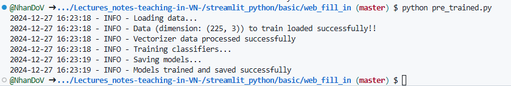
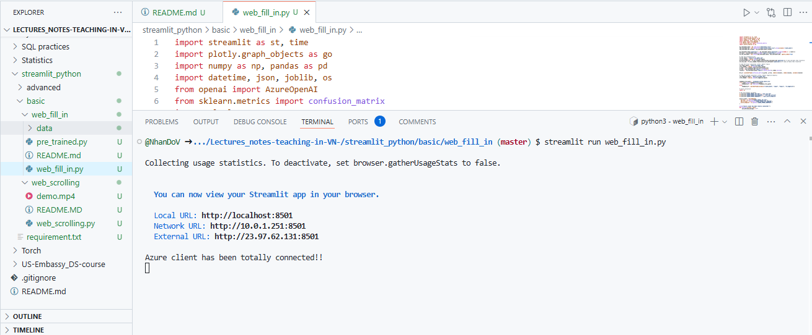
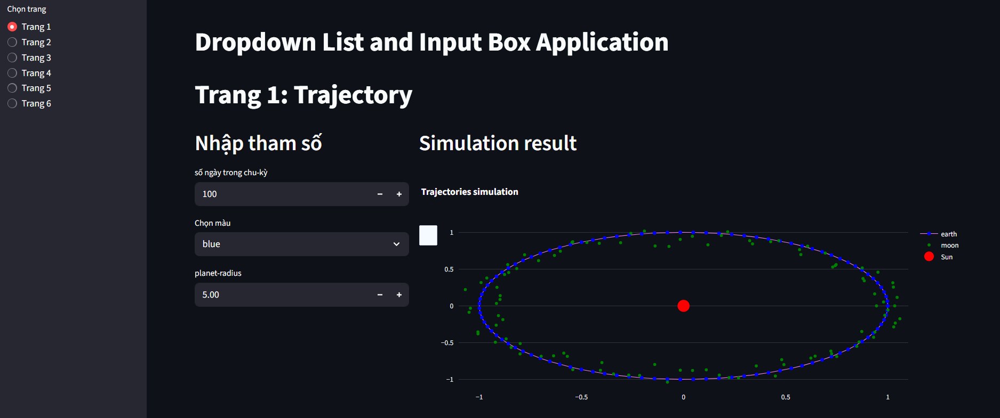
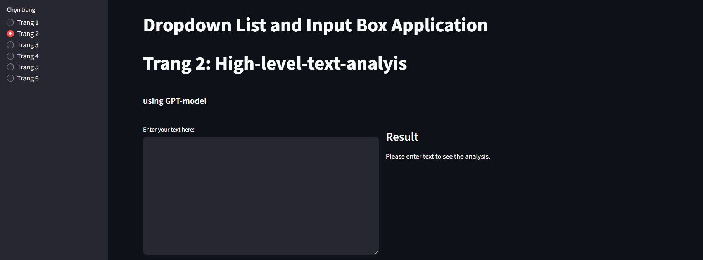
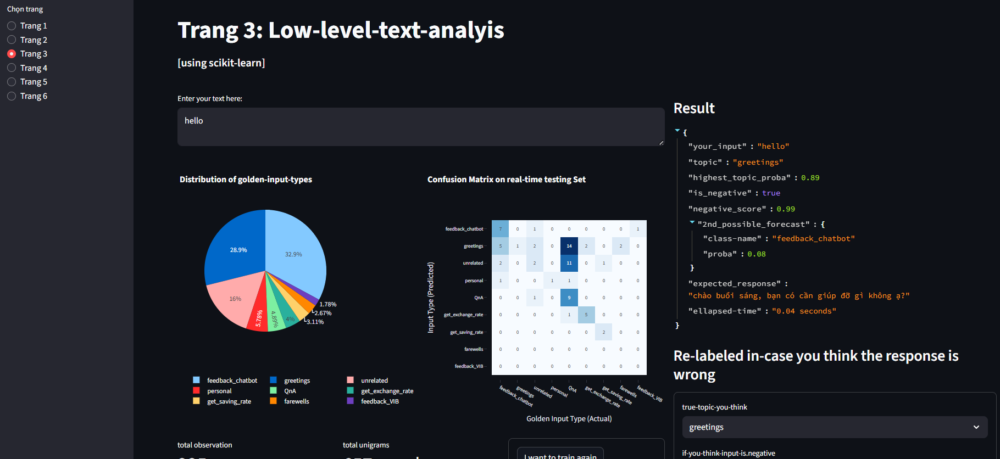
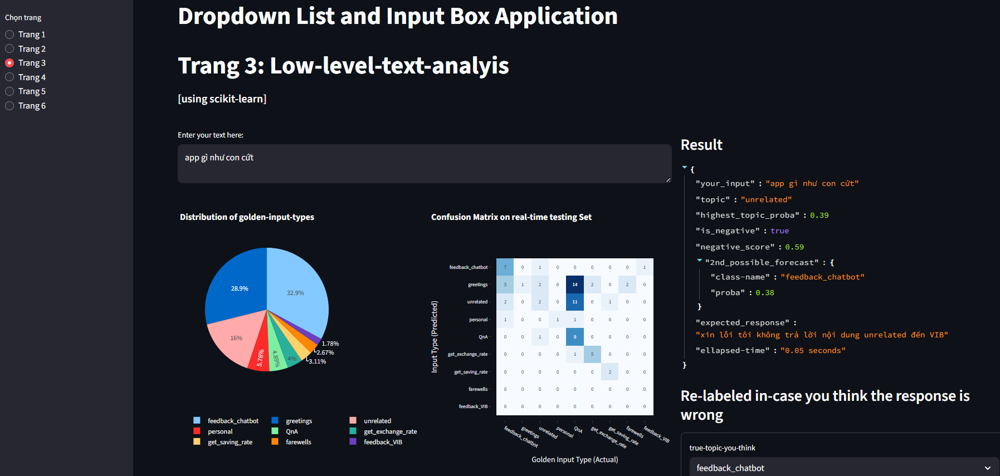

#### Step 1. Install streamlit

```bash
pip install streamlit plotly openpyxl openai scikit-learn
```

#### Step 2. pre-trained your sklearn model
```bash
python pre_trained.py
```



#### Step 3. run the python.file

```bash
streamlit run web_scrolling.py
```




#### Results
- **Page 1**


- **Page 2**


- **Page 3**

